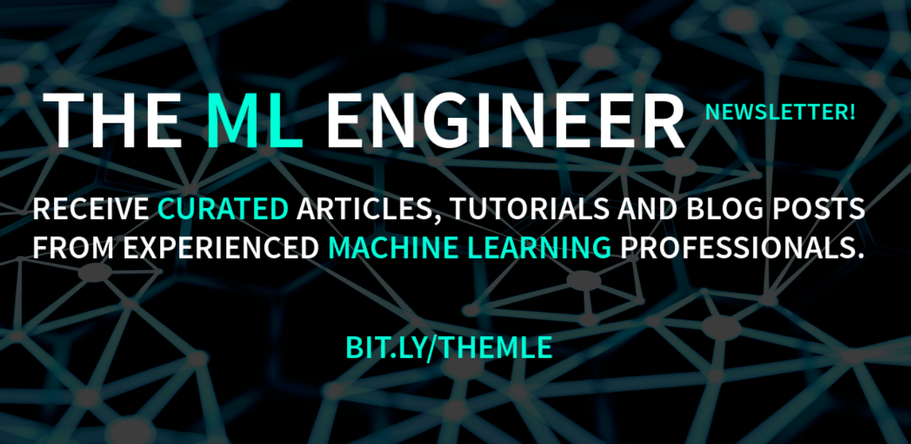
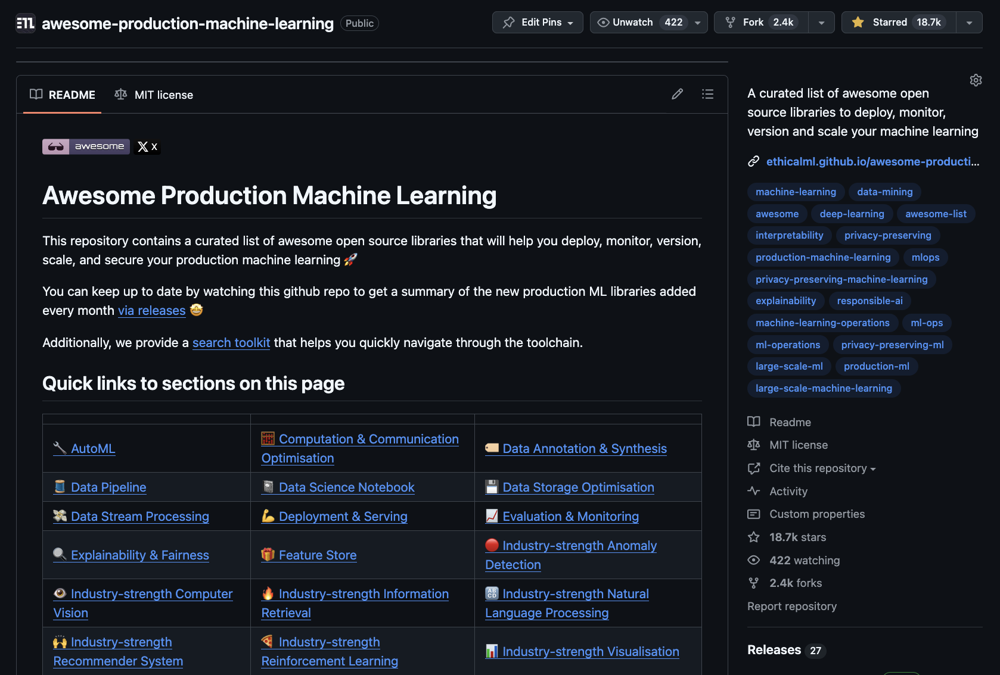

# Awesome Agentic Engineering Resources

> A curated list of high-signal resources — articles, books, courses, cookbooks, papers, playbooks, benchmarks, talks, podcasts, and newsletters — for agentic engineering and AI engineering.

This is a *resources* list, not a tools list. Open-source **tools** for building agentic systems live in the sister list [awesome-production-agentic-systems](https://github.com/EthicalML/awesome-production-agentic-systems); production ML tooling lives in [awesome-production-machine-learning](https://github.com/EthicalML/awesome-production-machine-learning). This list covers the *learning, design, and operational resources* that sit alongside those tools — including both:

- **Agentic engineering** — using AI agents to do software engineering (Copilot, Cursor, Claude Code, Aider, Cline, Windsurf, Codex; spec-driven development; context engineering; agent IDE rules and memory files; SWE benchmarks).
- **AI / agentic systems engineering** — building agentic and LLM-powered systems (architecture, RAG, memory, tool use & MCP, orchestration, multi-agent coordination, evaluation, observability, guardrails, safety, fine-tuning, inference, product/UX, economics, teams).

You can keep up to date by watching this repo for the monthly releases summarising newly added resources 🤩

This list was proposed in [EthicalML/awesome-production-machine-learning#709](https://github.com/EthicalML/awesome-production-machine-learning/issues/709) as a sister list focused on *resources* rather than tools.

## Legend

Resources are tagged with icons so you can scan and filter at a glance:

| Icon | Meaning |
|---|---|
| ⭐ | Editors' pick — start here |
| 🆓 | Free to access |
| 💰 | Paid |
| 📘 | Book |
| 🧑‍🎓 | Course |
| 🎥 | Video / talk |
| 🎧 | Audio / podcast |
| 📄 | Paper |
| 🛠️ | Hands-on cookbook / tutorial |
| 📋 | Playbook / design-pattern catalog |
| 🧪 | Benchmark / leaderboard |
| 🏗️ | Reference implementation / case study |
| 📰 | Newsletter |

## Quick links to sections on this page

|   |   |   |
|---|---|---|
| [⭐ Trending / What's New](#trending) | [🧭 Core & Foundations](#core) | [🗓️ Milestones Timeline](#milestones) |
| [👥 Communities](#communities) | [🧑‍🎓 Courses](#courses) | [📘 Books](#books) |
| [✍️ Articles & Essays](#articles) | [🛠️ Tutorials & Cookbooks](#tutorials) | [📋 Playbooks & Patterns](#playbooks) |
| [📄 Papers & Research](#papers) | [🧪 Benchmarks & Leaderboards](#benchmarks) | [🏗️ Reference Implementations](#references) |
| [🎥 Talks & Conferences](#talks) | [🎧 Podcasts](#podcasts) | [📰 Newsletters](#newsletters) |
| [🛡️ Governance, Safety & Responsible AI](#governance) | [🎨 Product, UX & Economics of AI](#product) | [🧑‍🤝‍🧑 Teams, Hiring & Org Design](#teams) |

## Topic Coverage Matrix

Resources are organised as a **matrix**: the top-level sections above (rows) are resource *types*, and each section is sub-divided by *topic*. The 21 topics, `T1`–`T21`, are shared across sections. This lets you read vertically ("what papers exist on RAG?") or horizontally ("where do I find resources on Coding Agents?").

**Topics:**

| # | Topic |
|---|---|
| T1 | Coding Agents & AI-Assisted Development (Copilot, Cursor, Claude Code, Aider, Cline, Windsurf, Codex) |
| T2 | Spec-Driven Development & Context Engineering (AGENTS.md, spec-kit, rules files) |
| T3 | Agent IDE Rules, Memory Files & Developer Workflows |
| T4 | SWE Benchmarks & Coding Evaluation |
| T5 | Autonomous Software Agents & Long-Horizon Engineering Tasks |
| T6 | LLM Application Architecture & System Design |
| T7 | Prompt Engineering |
| T8 | Retrieval-Augmented Generation (RAG) |
| T9 | Memory Systems & Long-Context |
| T10 | Tool Use, Function Calling & MCP |
| T11 | Orchestration, Planning & Design Patterns |
| T12 | Multi-Agent Systems & Coordination |
| T13 | Evaluation & Testing |
| T14 | Observability, Tracing & Debugging |
| T15 | Guardrails & Security (prompt injection, jailbreaks, red-teaming) |
| T16 | Safety, Alignment & Responsible AI |
| T17 | Fine-tuning, Post-training, RLHF & Reasoning Training |
| T18 | Inference, Serving, Cost & Latency |
| T19 | Voice, Multi-modal & Embodied Agents |
| T20 | Product, UX & Human-AI Interaction Design |
| T21 | Economics, Teams, Hiring & Org Design |

**Coverage** (`●` = populated, `○` = opportunistic / partial, `—` = out of scope for that row):

| Row \ Topic | T1 | T2 | T3 | T4 | T5 | T6 | T7 | T8 | T9 | T10 | T11 | T12 | T13 | T14 | T15 | T16 | T17 | T18 | T19 | T20 | T21 |
|---|---|---|---|---|---|---|---|---|---|---|---|---|---|---|---|---|---|---|---|---|---|
| Core & Foundations | ● | ● | ○ | ○ | ○ | ● | ● | ● | ○ | ● | ● | ○ | ● | ○ | ○ | ○ | ○ | ○ | ○ | ○ | ○ |
| Communities | ● | ○ | ○ | ○ | ○ | ● | ● | ● | ○ | ● | ● | ○ | ● | ● | ○ | ● | ● | ● | ○ | ● | ● |
| Courses | ● | ○ | ○ | ● | ○ | ● | ● | ● | ○ | ● | ● | ● | ● | ● | ● | ● | ● | ● | ○ | ○ | ○ |
| Books | ● | ○ | ○ | — | ○ | ● | ● | ● | ○ | ● | ● | ○ | ● | ○ | ● | ● | ● | ● | ○ | ● | ● |
| Articles & Essays | ● | ● | ● | ● | ● | ● | ● | ● | ● | ● | ● | ● | ● | ● | ● | ● | ● | ● | ● | ● | ● |
| Tutorials & Cookbooks | ● | ● | ● | ○ | ● | ● | ● | ● | ● | ● | ● | ● | ● | ● | ● | ○ | ● | ● | ● | ○ | — |
| Playbooks & Patterns | ● | ● | ● | ● | ● | ● | ● | ● | ● | ● | ● | ● | ● | ● | ● | ● | ○ | ● | ○ | ● | ● |
| Papers & Research | ● | ○ | — | ● | ● | ● | ● | ● | ● | ● | ● | ● | ● | ● | ● | ● | ● | ● | ● | ● | ○ |
| Benchmarks | ● | — | — | ● | ● | ○ | ○ | ● | ○ | ● | ● | ● | ● | ○ | ● | ● | ○ | ● | ● | ○ | — |
| Reference Impls | ● | ● | ● | ● | ● | ● | ○ | ● | ● | ● | ● | ● | ● | ● | ● | ○ | ● | ● | ● | ● | ● |
| Talks & Conferences | ● | ● | ○ | ● | ● | ● | ● | ● | ● | ● | ● | ● | ● | ● | ● | ● | ● | ● | ● | ● | ● |
| Podcasts | ● | ○ | ○ | ○ | ● | ● | ● | ● | ○ | ● | ● | ● | ● | ● | ● | ● | ● | ● | ○ | ● | ● |
| Newsletters | ● | ○ | ○ | ○ | ○ | ● | ● | ● | ○ | ● | ● | ○ | ● | ● | ● | ● | ● | ● | ○ | ● | ● |

The **Trending / What's New**, **Milestones Timeline**, **Governance & Responsible AI**, **Product / UX / Economics**, and **Teams, Hiring & Org Design** sections collapse across topics and are presented as curated lists rather than matrix cells.

## Contributing to the list

Please review our [CONTRIBUTING.md](./CONTRIBUTING.md) before submitting a PR — it explains the one-line description style, how to pick the right row/topic cell, and the quality bar for inclusion. Thank you to the community for supporting the list's growth 🚀

## Want to receive recurrent updates on this repo and other advancements?

<table>
  <tr>
    <td width="30%">
         You can join the <a href="https://ethical.institute/mle.html">Machine Learning Engineer</a> newsletter. Join over 70,000 ML professionals and enthusiasts who receive weekly curated articles & tutorials on production Machine Learning.
    </td>
    <td width="70%">
        
    </td>
  </tr>
  <tr>
    <td width="30%">
         Also check out <a href="https://github.com/EthicalML/awesome-production-agentic-systems">Awesome Production Agentic Systems</a> and <a href="https://github.com/EthicalML/awesome-production-machine-learning">Awesome Production Machine Learning</a>, the sister lists of open-source <em>tools</em> for agentic systems and production ML respectively.
    </td>
    <td width="70%">
        
    </td>
  </tr>
</table>

<picture>
  <source
    media="(prefers-color-scheme: dark)"
    srcset="
      https://api.star-history.com/svg?repos=EthicalML/awesome-agentic-engineering-resources&type=Date&theme=dark
    "
  />
  <source
    media="(prefers-color-scheme: light)"
    srcset="
      https://api.star-history.com/svg?repos=EthicalML/awesome-agentic-engineering-resources&type=Date
    "
  />
  
</picture>

# Main Content

## ⭐ Trending / What's New

*Rotating pinned items: the most-discussed agentic & AI-engineering resources of the current cycle. Refreshed regularly — see [CONTRIBUTING.md](./CONTRIBUTING.md) for nomination criteria.*

- ⭐ 🆓 [**Building effective agents**](https://www.anthropic.com/engineering/building-effective-agents) — Anthropic (2024). The most-cited reference for agent design patterns (augmented LLM, prompt chaining, routing, parallelisation, orchestrator-workers, evaluator-optimiser, autonomous agents). Start here before any other agent reading.
- ⭐ 🆓 [**How we built our multi-agent research system**](https://www.anthropic.com/engineering/built-multi-agent-research-system) — Anthropic (2025). Production retrospective on Claude's multi-agent research mode: orchestrator/subagent split, prompt engineering for agents, evaluation and failure modes.
- ⭐ 🆓 [**A practical guide to building agents**](https://cdn.openai.com/business-guides-and-resources/a-practical-guide-to-building-agents.pdf) — OpenAI (2025). 30-page PDF covering when (and when not) to build agents, tool design, guardrails, and human-in-the-loop patterns.
- ⭐ 🆓 [**The bitter lesson of AI agents**](https://lucumr.pocoo.org/2025/6/12/agentic-coding/) / [**Agentic Coding: The Future of Software Development with Agents**](https://lucumr.pocoo.org/) — Armin Ronacher (2025). Widely-shared essays on what it actually feels like to ship with agentic coding tools day-to-day.
- 🆓 [**Claude Code: Best practices for agentic coding**](https://www.anthropic.com/engineering/claude-code-best-practices) — Anthropic (2025). CLAUDE.md, slash-commands, headless mode, custom permissions — the canonical how-to-use-Claude-Code reference.
- 🆓 [**How to build an agent**](https://ampcode.com/how-to-build-an-agent) — Thorsten Ball / Amp (2025). Viral step-by-step implementation of a tool-using coding agent in ~400 lines of Go, demystifying "what is an agent" in code.
- 🆓 [**The new code**](https://www.latent.space/p/new-code) — Sean Grove / OpenAI on Latent Space (2025). Specs-as-code: the spec is the new artefact, models are the compiler. Heavily cited in the AGENTS.md / spec-kit discussion.
- 🆓 [**AGENTS.md**](https://agents.md/) — Community standard (2025) for per-repo agent instructions, now read by Claude Code, Codex, Aider, Cursor, Cline, Windsurf and others.

## 🧭 Core & Foundations

*Canonical "what is agentic engineering / AI engineering" reading. Start here.*

### T1 · Coding Agents & AI-Assisted Development

- ⭐ 🆓 [**Building effective agents**](https://www.anthropic.com/engineering/building-effective-agents) — Anthropic. The reference taxonomy of agent design patterns (workflows vs. agents).
- ⭐ 🆓 [**Claude Code: Best practices for agentic coding**](https://www.anthropic.com/engineering/claude-code-best-practices) — Anthropic. CLAUDE.md, tools, slash-commands, headless mode.
- 🆓 [**How to build an agent**](https://ampcode.com/how-to-build-an-agent) — Thorsten Ball. A working coding agent in ~400 lines; the clearest "agents are not magic" walkthrough.
- 🆓 [**Here's how I use LLMs to help me write code**](https://simonwillison.net/2025/Mar/11/using-llms-for-code/) — Simon Willison. Grounded, practice-first account of daily LLM-assisted development.

### T2 · Spec-Driven Development & Context Engineering

- ⭐ 🆓 [**The new code**](https://www.latent.space/p/new-code) — Sean Grove (OpenAI) on Latent Space. The canonical "specs are the new code" essay.
- 🆓 [**AGENTS.md**](https://agents.md/) — Community standard for per-repo agent instructions.
- 🆓 [**spec-kit**](https://github.com/github/spec-kit) — GitHub's toolkit and essay set on spec-driven development with coding agents.
- 🆓 [**The rise of "context engineering"**](https://blog.langchain.com/the-rise-of-context-engineering/) — LangChain. Why prompt engineering became context engineering.

### T6 · LLM Application Architecture & System Design

- ⭐ 📘 💰 [**AI Engineering**](https://www.oreilly.com/library/view/ai-engineering/9781098166298/) — Chip Huyen (O'Reilly, 2025). The textbook for building LLM applications end-to-end.
- ⭐ 🆓 [**Patterns for Building LLM-based Systems & Products**](https://eugeneyan.com/writing/llm-patterns/) — Eugene Yan. Evaluation, RAG, fine-tuning, caching, guardrails, defensive UX, collecting feedback — the reference pattern catalogue.
- 🆓 [**Emerging Architectures for LLM Applications**](https://a16z.com/emerging-architectures-for-llm-applications/) — a16z. The widely-shared reference diagram for the LLM app stack.
- 🆓 [**What We Learned from a Year of Building with LLMs**](https://applied-llms.org/) — Yan, Bensal, Bhawal, Husain, Shankar (2024). Tactical, operational, and strategic lessons distilled from shipping.

### T7 · Prompt Engineering

- ⭐ 🆓 [**Prompt Engineering**](https://lilianweng.github.io/posts/2023-03-15-prompt-engineering/) — Lilian Weng (OpenAI). The systematic taxonomy.
- 🆓 [**Prompt Engineering Guide**](https://www.promptingguide.ai/) — DAIR.AI. Continuously updated, with per-technique deep-dives.
- 🆓 [**OpenAI: Prompt engineering**](https://platform.openai.com/docs/guides/prompt-engineering) — OpenAI official guide.
- 🆓 [**Anthropic: Prompt engineering overview**](https://docs.anthropic.com/en/docs/build-with-claude/prompt-engineering/overview) — Anthropic's practical guide for Claude.

### T8 · Retrieval-Augmented Generation (RAG)

- ⭐ 📄 🆓 [**Retrieval-Augmented Generation for Knowledge-Intensive NLP Tasks**](https://arxiv.org/abs/2005.11401) — Lewis et al. (2020). The original RAG paper.
- ⭐ 🆓 [**Advanced RAG Techniques**](https://www.pinecone.io/learn/advanced-rag-techniques/) / [**Pinecone Learn**](https://www.pinecone.io/learn/) — Pinecone. The hub for RAG primers and patterns.
- 🆓 [**Retrieval-Augmented Generation for LLMs: A Survey**](https://arxiv.org/abs/2312.10997) — Gao et al. (2023). The reference survey.
- 🆓 [**RAG is more than just embedding search**](https://jxnl.co/writing/2024/06/11/rag-is-more-than-just-embedding-search/) — Jason Liu. Systems-view RAG: query understanding, tool routing, evaluation.

### T10 · Tool Use, Function Calling & MCP

- ⭐ 🆓 [**Introducing the Model Context Protocol**](https://www.anthropic.com/news/model-context-protocol) — Anthropic (2024). The canonical introduction to MCP.
- ⭐ 🆓 [**Model Context Protocol — Specification**](https://modelcontextprotocol.io/) — Open protocol docs and SDKs.
- 📄 🆓 [**Toolformer: Language Models Can Teach Themselves to Use Tools**](https://arxiv.org/abs/2302.04761) — Schick et al. (2023). The foundational tool-use paper.
- 🆓 [**Function calling guide**](https://platform.openai.com/docs/guides/function-calling) — OpenAI. The canonical reference for structured tool calls.

### T11 · Orchestration, Planning & Design Patterns

- ⭐ 🆓 [**Building effective agents**](https://www.anthropic.com/engineering/building-effective-agents) — Anthropic. The orchestration pattern taxonomy.
- 🆓 [**LLM Powered Autonomous Agents**](https://lilianweng.github.io/posts/2023-06-23-agent/) — Lilian Weng. The canonical deep-dive on planning, memory, and tool use in agent loops.
- 📄 🆓 [**ReAct: Synergizing Reasoning and Acting in Language Models**](https://arxiv.org/abs/2210.03629) — Yao et al. (2022). The foundational reason+act loop.
- 📄 🆓 [**The Rise and Potential of LLM Based Agents: A Survey**](https://arxiv.org/abs/2309.07864) — Xi et al. (2023). Survey of agent architectures and components.

### T13 · Evaluation & Testing

- ⭐ 🆓 [**Your AI Product Needs Evals**](https://hamel.dev/blog/posts/evals/) — Hamel Husain. The most-cited essay on why and how to build evals for LLM products.
- 🆓 [**Task-Specific LLM Evals that Do & Don't Work**](https://eugeneyan.com/writing/evals/) — Eugene Yan. A pragmatic survey of eval techniques per task type.
- 📄 🆓 [**Judging LLM-as-a-Judge**](https://arxiv.org/abs/2306.05685) — Zheng et al. (2023). The foundational LLM-as-judge paper (MT-Bench, Chatbot Arena).
- 🆓 [**Who Validates the Validators? Aligning LLM-Assisted Evaluation of LLM Outputs with Human Preferences**](https://arxiv.org/abs/2404.12272) — Shankar et al. (2024). How to make LLM-judges trustworthy.

## 🗓️ Milestones Timeline

*Dated, field-defining events that shaped agentic & AI engineering.*

| Date | Event | Reference |
|---|---|---|
| 2017-06 | Transformer architecture introduced | [Attention Is All You Need](https://arxiv.org/abs/1706.03762) |
| 2020-05 | GPT-3 shows in-context learning at scale | [Language Models are Few-Shot Learners](https://arxiv.org/abs/2005.14165) |
| 2020-05 | RAG framework introduced | [RAG for Knowledge-Intensive NLP](https://arxiv.org/abs/2005.11401) |
| 2021-06 | GitHub Copilot preview launches — first mainstream AI coding assistant | [GitHub blog](https://github.blog/news-insights/product-news/introducing-github-copilot-ai-pair-programmer/) |
| 2022-01 | Chain-of-Thought prompting | [Wei et al.](https://arxiv.org/abs/2201.11903) |
| 2022-03 | InstructGPT / RLHF | [Ouyang et al.](https://arxiv.org/abs/2203.02155) |
| 2022-10 | ReAct: reasoning + acting agent loop | [Yao et al.](https://arxiv.org/abs/2210.03629) |
| 2022-11 | ChatGPT release — mainstream adoption inflection | [OpenAI](https://openai.com/index/chatgpt/) |
| 2023-03 | GPT-4 release | [OpenAI](https://openai.com/index/gpt-4/) |
| 2023-03 | HuggingGPT / Toolformer-era tool use | [Toolformer](https://arxiv.org/abs/2302.04761) |
| 2023-03 | LangChain & LlamaIndex hit mainstream | — |
| 2023-05 | Voyager: open-ended agents in Minecraft | [Voyager](https://arxiv.org/abs/2305.16291) |
| 2023-06 | Simon Willison coins "prompt injection" as a durable threat category | [SW blog](https://simonwillison.net/series/prompt-injection/) |
| 2023-10 | SWE-bench released — real-world coding eval | [SWE-bench](https://www.swebench.com/) |
| 2023-12 | Mixture-of-experts open models (Mixtral) | [Mistral](https://mistral.ai/news/mixtral-of-experts/) |
| 2024-03 | Devin demo — autonomous software agent pitch | [Cognition](https://cognition.ai/blog/introducing-devin) |
| 2024-05 | GPT-4o: native multi-modal + realtime voice | [OpenAI](https://openai.com/index/hello-gpt-4o/) |
| 2024-06 | Anthropic's "Building effective agents" publishes | [Anthropic](https://www.anthropic.com/engineering/building-effective-agents) |
| 2024-07 | SWE-bench Verified launched | [OpenAI](https://openai.com/index/introducing-swe-bench-verified/) |
| 2024-09 | o1 reveals reasoning-model era | [OpenAI](https://openai.com/index/learning-to-reason-with-llms/) |
| 2024-11 | Model Context Protocol (MCP) announced | [Anthropic](https://www.anthropic.com/news/model-context-protocol) |
| 2025-02 | Claude Code general availability | [Anthropic](https://www.anthropic.com/claude-code) |
| 2025-05 | AGENTS.md published as cross-agent standard | [agents.md](https://agents.md/) |
| 2025-06 | GitHub spec-kit / "new code" essays formalise spec-driven dev | [spec-kit](https://github.com/github/spec-kit) |

## 👥 Communities

*Discords, Slacks, forums, and meetups where practitioners gather.*

- 🆓 [**MLOps Community**](https://mlops.community/) — Slack + podcast + meetups; the biggest practitioner community at the ops/engineering intersection. Active agent and LLM-ops channels.
- 🆓 [**LangChain Discord**](https://discord.gg/langchain) — Heavy day-to-day Q&A on agent orchestration, RAG, evaluation, MCP.
- 🆓 [**LlamaIndex Discord**](https://discord.gg/dGcwcsnxhU) — RAG-centric builder community with active reference-impl discussion.
- 🆓 [**r/LocalLLaMA**](https://www.reddit.com/r/LocalLLaMA/) — The definitive open-weights / local-inference forum; fastest signal for new models, quantisation, and serving.
- 🆓 [**r/MachineLearning**](https://www.reddit.com/r/MachineLearning/) — Academic and practitioner mix; where new papers and threads get dissected.
- 🆓 [**Hacker News**](https://news.ycombinator.com/) — Filter for "LLM", "agent", "Claude", "Cursor" — where engineering-side essays trend.
- 🆓 [**EleutherAI Discord**](https://discord.gg/zBGx3azzUn) — Open research community; strong training/interpretability discussion.
- 🆓 [**Hugging Face Discord & Forums**](https://huggingface.co/join/discord) — Transformers, TRL, PEFT, model-hub discussions.
- 🆓 [**AI Engineer World's Fair / Latent Space Discord**](https://discord.gg/latent-space) — Practitioner community anchoring the AI Engineer conference series.
- 🆓 [**Cursor Community Forum**](https://forum.cursor.com/) — User-driven forum for Cursor rules, MCP, and workflows.
- 🆓 [**Anthropic Discord**](https://www.anthropic.com/discord) — Official Claude / Claude Code / MCP community.

## 🧑‍🎓 Courses

*Structured courses — free and paid, university and industry.*

### T1 · Coding Agents & AI-Assisted Development

- ⭐ 🧑‍🎓 🆓 [**AI Python for Beginners**](https://www.deeplearning.ai/short-courses/ai-python-for-beginners/) — DeepLearning.AI (Andrew Ng). Gateway to AI-assisted coding.
- 🧑‍🎓 🆓 [**Pair Programming with a Large Language Model**](https://www.deeplearning.ai/short-courses/pair-programming-llm/) — DeepLearning.AI + Google.
- 🧑‍🎓 🆓 [**GitHub Copilot Fundamentals**](https://learn.microsoft.com/en-us/training/paths/copilot/) — Microsoft Learn. Official training path.

### T4 · SWE Benchmarks & Coding Evaluation

- 🧑‍🎓 🆓 [**Evaluating and Debugging Generative AI**](https://www.deeplearning.ai/short-courses/evaluating-debugging-generative-ai/) — DeepLearning.AI + W&B. Covers coding-eval mechanics.
- 🧑‍🎓 🆓 [**Mastering LLMs: Evals**](https://maven.com/parlance-labs/evals) — Hamel Husain & Shreya Shankar (Maven). Companion evals-for-LLMs curriculum.
- 🧑‍🎓 🆓 [**SWE-bench tutorial**](https://www.swebench.com/lite.html) — Princeton NLP. Free, self-paced walk-through of running and scoring coding evals.

### T6 · LLM Application Architecture & System Design

- ⭐ 🧑‍🎓 🆓 [**LLM Bootcamp**](https://fullstackdeeplearning.com/llm-bootcamp/) — Full Stack Deep Learning. Free 2-day bootcamp on building LLM apps end-to-end.
- 🧑‍🎓 🆓 [**Building Systems with the ChatGPT API**](https://www.deeplearning.ai/short-courses/building-systems-with-chatgpt/) — DeepLearning.AI + OpenAI.
- 🧑‍🎓 🆓 [**CS25: Transformers United**](https://web.stanford.edu/class/cs25/) — Stanford. Seminal deep-dive seminar series.

### T7 · Prompt Engineering

- ⭐ 🧑‍🎓 🆓 [**ChatGPT Prompt Engineering for Developers**](https://www.deeplearning.ai/short-courses/chatgpt-prompt-engineering-for-developers/) — Andrew Ng & Isa Fulford (OpenAI).
- 🧑‍🎓 🆓 [**Anthropic Prompt Engineering Interactive Tutorial**](https://github.com/anthropics/prompt-eng-interactive-tutorial) — Anthropic. Hands-on, notebook-based.
- 🧑‍🎓 🆓 [**Prompt Engineering Guide (DAIR.AI)**](https://www.promptingguide.ai/) — Self-paced, continuously updated.

### T8 · Retrieval-Augmented Generation (RAG)

- 🧑‍🎓 🆓 [**Advanced Retrieval for AI with Chroma**](https://www.deeplearning.ai/short-courses/advanced-retrieval-for-ai/) — DeepLearning.AI.
- 🧑‍🎓 🆓 [**Building and Evaluating Advanced RAG Applications**](https://www.deeplearning.ai/short-courses/building-evaluating-advanced-rag/) — DeepLearning.AI + LlamaIndex + TruEra.
- 🧑‍🎓 🆓 [**LangChain Chat with Your Data**](https://www.deeplearning.ai/short-courses/langchain-chat-with-your-data/) — DeepLearning.AI + LangChain.
- 🧑‍🎓 💰 [**Systematically Improving RAG Applications**](https://maven.com/applied-llms/rag-playbook) — Jason Liu on Maven.

### T10 · Tool Use, Function Calling & MCP

- 🧑‍🎓 🆓 [**Functions, Tools and Agents with LangChain**](https://www.deeplearning.ai/short-courses/functions-tools-agents-langchain/) — DeepLearning.AI + LangChain.
- 🧑‍🎓 🆓 [**MCP: Build Rich-Context AI Apps with Anthropic**](https://www.deeplearning.ai/short-courses/mcp-build-rich-context-ai-apps-with-anthropic/) — DeepLearning.AI + Anthropic.
- 🧑‍🎓 🆓 [**Introduction to MCP**](https://modelcontextprotocol.io/quickstart) — Anthropic official quickstart.

### T11 · Orchestration, Planning & Design Patterns

- 🧑‍🎓 🆓 [**AI Agents in LangGraph**](https://www.deeplearning.ai/short-courses/ai-agents-in-langgraph/) — DeepLearning.AI + LangChain.
- 🧑‍🎓 🆓 [**AI Agentic Design Patterns with AutoGen**](https://www.deeplearning.ai/short-courses/ai-agentic-design-patterns-with-autogen/) — DeepLearning.AI + Microsoft.
- 🧑‍🎓 🆓 [**Hugging Face Agents Course**](https://huggingface.co/learn/agents-course) — Hugging Face. Free, certifying course on agent fundamentals.

### T12 · Multi-Agent Systems

- 🧑‍🎓 🆓 [**Multi AI Agent Systems with crewAI**](https://www.deeplearning.ai/short-courses/multi-ai-agent-systems-with-crewai/) — DeepLearning.AI + crewAI.
- 🧑‍🎓 🆓 [**Practical Multi AI Agents and Advanced Use Cases with crewAI**](https://www.deeplearning.ai/short-courses/practical-multi-ai-agents-and-advanced-use-cases-with-crewai/) — DeepLearning.AI.
- 🧑‍🎓 🆓 [**Building Agentic RAG with LlamaIndex**](https://www.deeplearning.ai/short-courses/building-agentic-rag-with-llamaindex/) — DeepLearning.AI + LlamaIndex.

### T13 · Evaluation & Testing

- ⭐ 🧑‍🎓 💰 [**AI Evals For Engineers & PMs**](https://maven.com/parlance-labs/evals) — Hamel Husain & Shreya Shankar on Maven. The industry-standard evals cohort course.
- 🧑‍🎓 🆓 [**Quality and Safety for LLM Applications**](https://www.deeplearning.ai/short-courses/quality-safety-llm-applications/) — DeepLearning.AI + WhyLabs.
- 🧑‍🎓 🆓 [**Automated Testing for LLMOps**](https://www.deeplearning.ai/short-courses/automated-testing-llmops/) — DeepLearning.AI + CircleCI.

### T14 · Observability, Tracing & Debugging

- 🧑‍🎓 🆓 [**LLMOps**](https://www.deeplearning.ai/short-courses/llmops/) — DeepLearning.AI + Google Cloud.
- 🧑‍🎓 🆓 [**Evaluating LLMs with Arize**](https://arize.com/llm-evaluation/) — Arize course hub.
- 🧑‍🎓 🆓 [**LangSmith Academy**](https://academy.langchain.com/) — LangChain. Free self-paced LangSmith courses covering tracing and evals.

### T15 · Guardrails & Security

- 🧑‍🎓 🆓 [**Red Teaming LLM Applications**](https://www.deeplearning.ai/short-courses/red-teaming-llm-applications/) — DeepLearning.AI + Giskard.
- 🧑‍🎓 🆓 [**Safe and Reliable AI via Guardrails**](https://www.deeplearning.ai/short-courses/safe-and-reliable-ai-via-guardrails/) — DeepLearning.AI + Guardrails AI.
- 🧑‍🎓 🆓 [**Prompt Injection Attacks (Learn Prompting)**](https://learnprompting.org/docs/prompt_hacking/injection) — Learn Prompting. Open course covering injection/jailbreak taxonomies.

### T16 · Safety, Alignment & Responsible AI

- 🧑‍🎓 🆓 [**AI Safety Fundamentals**](https://aisafetyfundamentals.com/) — BlueDot Impact. The standard entry curriculum.
- 🧑‍🎓 🆓 [**ARENA (Alignment Research Engineer Accelerator)**](https://www.arena.education/) — Hands-on alignment / interpretability.
- 🧑‍🎓 🆓 [**Intro to AI Safety, Remastered**](https://course.aisafetyfundamentals.com/alignment) — Richard Ngo / BlueDot. Free reading curriculum.

### T17 · Fine-tuning, Post-training & RLHF

- ⭐ 🧑‍🎓 🆓 [**Finetuning Large Language Models**](https://www.deeplearning.ai/short-courses/finetuning-large-language-models/) — DeepLearning.AI + Lamini.
- 🧑‍🎓 🆓 [**Reinforcement Learning from Human Feedback**](https://www.deeplearning.ai/short-courses/reinforcement-learning-from-human-feedback/) — DeepLearning.AI + Google Cloud.
- 🧑‍🎓 🆓 [**Hugging Face NLP Course (incl. RLHF chapter)**](https://huggingface.co/learn/nlp-course) — Hugging Face.

### T18 · Inference, Serving, Cost & Latency

- 🧑‍🎓 🆓 [**Efficiently Serving LLMs**](https://www.deeplearning.ai/short-courses/efficiently-serving-llms/) — DeepLearning.AI + Predibase.
- 🧑‍🎓 🆓 [**Quantization Fundamentals with Hugging Face**](https://www.deeplearning.ai/short-courses/quantization-fundamentals-with-hugging-face/) — DeepLearning.AI + HF.
- 🧑‍🎓 🆓 [**CUDA Mode lectures**](https://github.com/cuda-mode/lectures) — Community lectures on GPU inference internals.

## 📘 Books

*Published and in-progress books covering agentic & AI engineering.*

### T1 · Coding Agents & AI-Assisted Development

- ⭐ 📘 💰 [**AI-Assisted Programming**](https://www.oreilly.com/library/view/ai-assisted-programming/9781098164555/) — Tom Taulli (O'Reilly, 2024). Practical coverage of Copilot/Cursor/Claude workflows.
- 📘 💰 [**Prompt Engineering for Generative AI**](https://www.oreilly.com/library/view/prompt-engineering-for/9781098153427/) — James Phoenix & Mike Taylor (O'Reilly, 2024). Includes heavy coverage of code-generation prompting patterns.

### T6 · LLM Application Architecture & System Design

- ⭐ 📘 💰 [**AI Engineering: Building Applications with Foundation Models**](https://www.oreilly.com/library/view/ai-engineering/9781098166298/) — Chip Huyen (O'Reilly, 2025). The reference textbook for the field.
- 📘 💰 [**Designing Machine Learning Systems**](https://www.oreilly.com/library/view/designing-machine-learning/9781098107956/) — Chip Huyen (O'Reilly, 2022). The prior-generation canonical ML-systems text; still essential for data/infra context.
- 📘 💰 [**Generative AI on AWS**](https://www.oreilly.com/library/view/generative-ai-on/9781098159214/) — Chris Fregly, Antje Barth, Shelbee Eigenbrode (O'Reilly, 2023).

### T7 · Prompt Engineering

- 📘 🆓 [**Prompt Engineering for LLMs**](https://www.oreilly.com/library/view/prompt-engineering-for/9781098156145/) — John Berryman & Albert Ziegler (O'Reilly, 2024). From Copilot's original tech-lead.
- 📘 💰 [**The Prompt Report**](https://arxiv.org/abs/2406.06608) — Schulhoff et al. (2024). A 76-page survey that effectively functions as a book-length prompting reference.

### T8 · RAG

- 📘 💰 [**Building LLM Apps**](https://www.wiley.com/en-us/Building+LLM+Apps%3A+Create+Intelligent+Apps+and+Agents+with+Large+Language+Models-p-9781394250202) — Valentina Alto (Wiley, 2024). RAG-heavy application text.
- 📘 🆓 [**RAG-Driven Generative AI**](https://www.packtpub.com/en-us/product/rag-driven-generative-ai-9781836200918) — Denis Rothman (Packt, 2024).

### T10 · Tool Use & MCP

- 📘 💰 [**Building Intelligent Apps with OpenAI**](https://www.oreilly.com/library/view/building-intelligent-apps/9781098159450/) — Olivier Caelen & Marie-Alice Blete (O'Reilly, 2024). Heavy function-calling coverage.

### T11 · Orchestration & Design Patterns

- 📘 💰 [**Generative AI with LangChain**](https://www.packtpub.com/en-in/product/generative-ai-with-langchain-9781835083468) — Ben Auffarth (Packt, 2023). Orchestration patterns end-to-end.

### T13 · Evaluation

- 📘 💰 [**Prompt Engineering for Generative AI**](https://www.oreilly.com/library/view/prompt-engineering-for/9781098153427/) — Phoenix & Taylor (O'Reilly, 2024). Chapter-length eval coverage.

### T15 · Guardrails & Security

- 📘 💰 [**The Developer's Playbook for Large Language Model Security**](https://www.oreilly.com/library/view/the-developers-playbook/9781098162191/) — Steve Wilson (O'Reilly, 2024). OWASP LLM Top 10 project lead's book.
- 📘 💰 [**Generative AI Security**](https://link.springer.com/book/10.1007/979-8-8688-0277-1) — Ken Huang et al. (Apress, 2024).

### T16 · Safety, Alignment & Responsible AI

- 📘 💰 [**Human Compatible**](https://people.eecs.berkeley.edu/~russell/hc.html) — Stuart Russell (2019). The foundational alignment argument.
- 📘 💰 [**The Alignment Problem**](https://brianchristian.org/the-alignment-problem/) — Brian Christian (2020). The canonical popular-press primer.

### T17 · Fine-tuning & Post-training

- ⭐ 📘 💰 [**Build a Large Language Model (From Scratch)**](https://www.manning.com/books/build-a-large-language-model-from-scratch) — Sebastian Raschka (Manning, 2024). The reference hands-on text.
- 📘 💰 [**Hands-On Large Language Models**](https://www.oreilly.com/library/view/hands-on-large-language/9781098150952/) — Jay Alammar & Maarten Grootendorst (O'Reilly, 2024).

### T18 · Inference & Serving

- 📘 💰 [**Efficient Processing of Deep Neural Networks**](https://link.springer.com/book/10.1007/978-3-031-01766-7) — Sze et al. (Morgan & Claypool). Hardware/inference reference.

### T20 · Product & UX

- 📘 💰 [**Designing Machine Learning Systems**](https://www.oreilly.com/library/view/designing-machine-learning/9781098107956/) — Chip Huyen. Includes pragmatic product/UX chapters.
- 📘 💰 [**Human-AI Interaction Design**](https://www.interaction-design.org/literature/topics/ai-interaction-design) — IxDF topic hub.

### T21 · Economics, Teams & Org

- 📘 💰 [**Managing Machine Learning Projects**](https://www.manning.com/books/managing-machine-learning-projects) — Simon Thompson (Manning).
- 📘 🆓 [**The Pragmatic Engineer's AI coverage**](https://newsletter.pragmaticengineer.com/) — Gergely Orosz. Regularly-updated editorial that functions as a rolling book on AI-engineering org design.

## ✍️ Articles & Essays

*Long-form writing from canonical authors and engineering teams.*

### T1 · Coding Agents & AI-Assisted Development

- ⭐ 🆓 [**Here's how I use LLMs to help me write code**](https://simonwillison.net/2025/Mar/11/using-llms-for-code/) — Simon Willison.
- 🆓 [**Agentic Coding: The Future of Software Development**](https://lucumr.pocoo.org/2025/6/12/agentic-coding/) — Armin Ronacher.
- 🆓 [**Revenge of the junior developer**](https://sourcegraph.com/blog/revenge-of-the-junior-developer) — Steve Yegge (Sourcegraph).
- 🆓 [**The death of the stubborn developer**](https://www.sourcegraph.com/blog/the-death-of-the-junior-developer) — Steve Yegge.

### T2 · Spec-Driven Development & Context Engineering

- ⭐ 🆓 [**The new code**](https://www.latent.space/p/new-code) — Sean Grove / Latent Space.
- 🆓 [**Context Engineering**](https://blog.langchain.com/context-engineering-for-agents/) — LangChain.
- 🆓 [**The rise of "context engineering"**](https://blog.langchain.com/the-rise-of-context-engineering/) — LangChain.
- 🆓 [**Spec-driven development with AI**](https://github.blog/ai-and-ml/generative-ai/spec-driven-development-with-ai-get-started-with-a-new-open-source-toolkit/) — GitHub Blog.

### T3 · Agent IDE Rules, Memory Files & Workflows

- ⭐ 🆓 [**Claude Code: Best practices for agentic coding**](https://www.anthropic.com/engineering/claude-code-best-practices) — Anthropic.
- 🆓 [**Cursor rules directory**](https://cursor.directory/) — Community catalogue of `.cursorrules` files.
- 🆓 [**My Claude Code setup**](https://htdocs.dev/posts/how-to-use-claude-code-to-wield-coding-agent-clusters/) — widely-shared CLAUDE.md + slash-command playbook.
- 🆓 [**Aider: Tips for using with large codebases**](https://aider.chat/docs/usage/tips.html) — Aider docs.

### T4 · SWE Benchmarks & Coding Evaluation

- ⭐ 🆓 [**Introducing SWE-bench Verified**](https://openai.com/index/introducing-swe-bench-verified/) — OpenAI.
- 🆓 [**Why we built Terminal-Bench**](https://www.tbench.ai/blog/terminal-bench) — Stanford / Laude.
- 🆓 [**Measuring an AI system's ability to do ML R&D**](https://metr.org/blog/2024-11-22-evaluating-r-d-capabilities-of-llms/) — METR.
- 🆓 [**The leaderboard illusion**](https://arxiv.org/abs/2504.20879) — Singh et al. on bench-gaming.

### T5 · Autonomous Software Agents

- ⭐ 🆓 [**How we built our multi-agent research system**](https://www.anthropic.com/engineering/built-multi-agent-research-system) — Anthropic.
- 🆓 [**Devin, a software engineer**](https://cognition.ai/blog/introducing-devin) — Cognition.
- 🆓 [**Don't build multi-agents**](https://cognition.ai/blog/dont-build-multi-agents) — Cognition. Contrarian but important counterpoint to multi-agent maximalism.
- 🆓 [**SWE-agent: Agent-Computer Interfaces**](https://swe-agent.com/latest/) — Princeton NLP writeup.

### T6 · LLM Application Architecture

- ⭐ 🆓 [**Patterns for Building LLM-based Systems & Products**](https://eugeneyan.com/writing/llm-patterns/) — Eugene Yan.
- 🆓 [**Emerging Architectures for LLM Applications**](https://a16z.com/emerging-architectures-for-llm-applications/) — a16z.
- 🆓 [**What We Learned from a Year of Building with LLMs**](https://applied-llms.org/) — Yan/Bensal/Bhawal/Husain/Shankar.
- 🆓 [**Twelve factor agents**](https://github.com/humanlayer/12-factor-agents) — HumanLayer. The "12-factor app" equivalent for agent apps.

### T7 · Prompt Engineering

- ⭐ 🆓 [**Prompt Engineering**](https://lilianweng.github.io/posts/2023-03-15-prompt-engineering/) — Lilian Weng.
- 🆓 [**Prompting is programming**](https://eugeneyan.com/writing/prompting/) — Eugene Yan.
- 🆓 [**A guide to prompting Claude**](https://docs.anthropic.com/en/docs/build-with-claude/prompt-engineering/overview) — Anthropic.
- 🆓 [**The prompt report**](https://learnprompting.org/blog/the_prompt_report) — Learn Prompting team summary of their 76-page survey.

### T8 · Retrieval-Augmented Generation (RAG)

- ⭐ 🆓 [**RAG is more than just embedding search**](https://jxnl.co/writing/2024/06/11/rag-is-more-than-just-embedding-search/) — Jason Liu.
- 🆓 [**How to improve your RAG system's performance**](https://www.anyscale.com/blog/a-comprehensive-guide-for-building-rag-based-llm-applications-part-1) — Anyscale.
- 🆓 [**Advanced RAG Techniques**](https://www.pinecone.io/learn/advanced-rag-techniques/) — Pinecone.
- 🆓 [**Practical considerations in RAG application design**](https://eugeneyan.com/writing/rag/) — Eugene Yan.

### T9 · Memory Systems & Long-Context

- ⭐ 🆓 [**Lost in the Middle: How Language Models Use Long Contexts**](https://arxiv.org/abs/2307.03172) — Liu et al.
- 🆓 [**Memory for agents**](https://blog.langchain.com/memory-for-agents/) — LangChain.
- 🆓 [**Extending Context Length in LLMs**](https://huggingface.co/blog/long-range-transformers) — Hugging Face.
- 🆓 [**The agentic memory stack**](https://www.letta.com/blog/memgpt) — Letta (MemGPT).

### T10 · Tool Use, Function Calling & MCP

- ⭐ 🆓 [**Introducing the Model Context Protocol**](https://www.anthropic.com/news/model-context-protocol) — Anthropic.
- 🆓 [**Function calling with LLMs: a practical guide**](https://www.promptingguide.ai/applications/function_calling) — DAIR.AI.
- 🆓 [**Tool use is eating the world**](https://latent.space/p/tools) — Latent Space.
- 🆓 [**Designing MCP servers that agents actually use**](https://www.philschmid.de/mcp-introduction) — Phil Schmid.

### T11 · Orchestration & Design Patterns

- ⭐ 🆓 [**LLM Powered Autonomous Agents**](https://lilianweng.github.io/posts/2023-06-23-agent/) — Lilian Weng.
- 🆓 [**Building effective agents**](https://www.anthropic.com/engineering/building-effective-agents) — Anthropic.
- 🆓 [**Agent design patterns**](https://www.deeplearning.ai/the-batch/issue-241/) — Andrew Ng, The Batch series.
- 🆓 [**AI agent frameworks**](https://www.latent.space/p/agent-frameworks) — Latent Space comparative review.

### T12 · Multi-Agent Systems & Coordination

- ⭐ 🆓 [**How we built our multi-agent research system**](https://www.anthropic.com/engineering/built-multi-agent-research-system) — Anthropic.
- 🆓 [**Multi-agent workflows**](https://blog.langchain.com/langgraph-multi-agent-workflows/) — LangChain.
- 🆓 [**Don't build multi-agents**](https://cognition.ai/blog/dont-build-multi-agents) — Cognition.
- 🆓 [**AutoGen: Enabling next-gen LLM applications**](https://microsoft.github.io/autogen/stable/user-guide/agentchat-user-guide/) — Microsoft.

### T13 · Evaluation & Testing

- ⭐ 🆓 [**Your AI product needs evals**](https://hamel.dev/blog/posts/evals/) — Hamel Husain.
- 🆓 [**Task-specific LLM evals that do & don't work**](https://eugeneyan.com/writing/evals/) — Eugene Yan.
- 🆓 [**Creating a LLM-as-a-Judge that drives business results**](https://hamel.dev/blog/posts/llm-judge/) — Hamel Husain.
- 🆓 [**LLM evals: everything I learned in 12 months**](https://www.shreya-shankar.com/evals-paper/) — Shreya Shankar.

### T14 · Observability, Tracing & Debugging

- ⭐ 🆓 [**So you want to build an LLM observability platform**](https://hamel.dev/blog/posts/evals/#observability) — Hamel Husain (subsection of evals post; foundational).
- 🆓 [**The OpenTelemetry Gen AI semantic conventions**](https://opentelemetry.io/docs/specs/semconv/gen-ai/) — OTel.
- 🆓 [**How Honeycomb uses LLMs for product experiences**](https://www.honeycomb.io/blog/hard-stuff-nobody-talks-about-llm) — Phillip Carter.
- 🆓 [**Logfire: observability for the LLM era**](https://pydantic.dev/logfire) — Pydantic.

### T15 · Guardrails & Security

- ⭐ 🆓 [**Prompt injection series**](https://simonwillison.net/series/prompt-injection/) — Simon Willison. Canonical ongoing series.
- 🆓 [**OWASP Top 10 for LLM Applications**](https://genai.owasp.org/llm-top-10/) — OWASP.
- 🆓 [**Universal and Transferable Adversarial Attacks on Aligned LLMs**](https://arxiv.org/abs/2307.15043) — Zou et al. (GCG attack).
- 🆓 [**Red teaming LLMs**](https://huggingface.co/blog/red-teaming) — Hugging Face.

### T16 · Safety, Alignment & Responsible AI

- ⭐ 🆓 [**Core Views on AI Safety**](https://www.anthropic.com/news/core-views-on-ai-safety) — Anthropic.
- 🆓 [**Anthropic's Responsible Scaling Policy**](https://www.anthropic.com/news/anthropics-responsible-scaling-policy) — Anthropic.
- 🆓 [**Preparedness Framework**](https://openai.com/safety/preparedness) — OpenAI.
- 🆓 [**Scalable oversight via debate & recursive reward modelling**](https://deepmindsafetyresearch.medium.com/) — DeepMind Safety Research.

### T17 · Fine-tuning, Post-training & RLHF

- ⭐ 🆓 [**Ahead of AI**](https://magazine.sebastianraschka.com/) — Sebastian Raschka. The canonical fine-tuning / post-training deep-dives.
- 🆓 [**The Novice's LLM Training Guide**](https://rentry.org/llm-training) — Community reference.
- 🆓 [**DPO: Your language model is secretly a reward model**](https://arxiv.org/abs/2305.18290) — Rafailov et al.
- 🆓 [**The alignment handbook**](https://github.com/huggingface/alignment-handbook) — Hugging Face.

### T18 · Inference, Serving, Cost & Latency

- ⭐ 🆓 [**Transformer Inference Arithmetic**](https://kipp.ly/transformer-inference-arithmetic/) — Kipply.
- 🆓 [**LLM Inference Speed of Light**](https://zeux.io/2024/03/15/llm-inference-sol/) — Arseny Kapoulkine.
- 🆓 [**Everything I've learned about efficient LLM inference**](https://www.baseten.co/blog/) — Baseten engineering blog.
- 🆓 [**GPU performance for LLM inference**](https://blog.vllm.ai/) — vLLM team blog.

### T19 · Voice, Multi-modal & Embodied Agents

- ⭐ 🆓 [**Hello GPT-4o**](https://openai.com/index/hello-gpt-4o/) — OpenAI.
- 🆓 [**Building a voice agent with LiveKit**](https://docs.livekit.io/agents/) — LiveKit Agents docs.
- 🆓 [**Voice-first LLM products**](https://www.latent.space/p/voice-2024) — Latent Space.
- 🆓 [**Moshi: a speech-text foundation model**](https://kyutai.org/Moshi.pdf) — Kyutai.

### T20 · Product, UX & Human-AI Interaction

- ⭐ 🆓 [**Maggie Appleton essays**](https://maggieappleton.com/) — Canonical AI-UX thinking.
- 🆓 [**Microsoft HAX guidelines for human-AI interaction**](https://www.microsoft.com/en-us/research/project/guidelines-for-human-ai-interaction/) — Microsoft Research.
- 🆓 [**Generative AI: Design Patterns (NNGroup)**](https://www.nngroup.com/articles/generative-ai-design-patterns/) — Nielsen Norman Group.
- 🆓 [**Building products with AI: UX lessons**](https://www.linusakesson.net/) / [**thesephist.com essays**](https://thesephist.com/) — Linus Lee.

### T21 · Economics, Teams, Hiring & Org Design

- ⭐ 🆓 [**AI engineering org design**](https://newsletter.pragmaticengineer.com/t/ai) — Gergely Orosz, Pragmatic Engineer.
- 🆓 [**Building an AI team**](https://eugeneyan.com/writing/team-size/) — Eugene Yan.
- 🆓 [**a16z AI canon**](https://a16z.com/ai-canon/) — a16z.
- 🆓 [**16 Changes to the Way Enterprises Build Software with AI**](https://a16z.com/16-changes-to-the-way-enterprises-are-building-and-buying-generative-ai/) — a16z.

## 🛠️ Tutorials & Cookbooks

*Hands-on, code-first guides and official cookbooks from model providers and framework authors.*

### T1 · Coding Agents & AI-Assisted Development

- ⭐ 🛠️ 🆓 [**Claude Code cookbook**](https://github.com/anthropics/claude-code) — Anthropic.
- 🛠️ 🆓 [**Aider tutorials**](https://aider.chat/docs/usage/tutorials.html) — Aider docs.
- 🛠️ 🆓 [**Continue.dev recipes**](https://docs.continue.dev/customize/tutorials/) — Continue.

### T2 · Spec-Driven Development

- 🛠️ 🆓 [**GitHub spec-kit**](https://github.com/github/spec-kit) — The official spec-driven-development toolkit.
- 🛠️ 🆓 [**AGENTS.md examples**](https://agents.md/examples) — Example `AGENTS.md` files for common stacks.

### T3 · Agent IDE Rules & Workflows

- 🛠️ 🆓 [**awesome-cursorrules**](https://github.com/PatrickJS/awesome-cursorrules) — Curated `.cursorrules` examples.
- 🛠️ 🆓 [**Claude Code slash-commands cookbook**](https://github.com/anthropics/claude-code/tree/main/examples/slash-commands) — Anthropic.

### T5 · Autonomous Software Agents

- 🛠️ 🆓 [**SWE-agent quickstart**](https://swe-agent.com/latest/usage/coding_challenges/) — Princeton NLP.
- 🛠️ 🆓 [**OpenHands (formerly OpenDevin)**](https://docs.all-hands.dev/) — All Hands AI.

### T6 · LLM Application Architecture

- ⭐ 🛠️ 🆓 [**OpenAI Cookbook**](https://cookbook.openai.com/) — The reference recipe library for OpenAI APIs.
- 🛠️ 🆓 [**Anthropic Cookbook**](https://github.com/anthropics/anthropic-cookbook) — Claude recipes.
- 🛠️ 🆓 [**Gemini API Cookbook**](https://github.com/google-gemini/cookbook) — Google.
- 🛠️ 🆓 [**Hugging Face Open-Source AI Cookbook**](https://huggingface.co/learn/cookbook/) — Hugging Face.

### T7 · Prompt Engineering

- 🛠️ 🆓 [**Anthropic prompt-engineering interactive tutorial**](https://github.com/anthropics/prompt-eng-interactive-tutorial) — Notebook-based.
- 🛠️ 🆓 [**Prompt Engineering Guide notebooks**](https://github.com/dair-ai/Prompt-Engineering-Guide/tree/main/notebooks) — DAIR.AI.

### T8 · Retrieval-Augmented Generation (RAG)

- ⭐ 🛠️ 🆓 [**LlamaIndex tutorials**](https://docs.llamaindex.ai/en/stable/getting_started/starter_example/) — LlamaIndex.
- 🛠️ 🆓 [**LangChain RAG from scratch**](https://github.com/langchain-ai/rag-from-scratch) — LangChain.
- 🛠️ 🆓 [**Pinecone RAG handbook**](https://www.pinecone.io/learn/retrieval-augmented-generation/) — Pinecone.
- 🛠️ 🆓 [**Advanced RAG notebooks**](https://github.com/NirDiamant/RAG_Techniques) — Nir Diamant. 30+ advanced RAG recipes.

### T9 · Memory Systems

- 🛠️ 🆓 [**Mem0 quickstart**](https://docs.mem0.ai/) — Mem0.
- 🛠️ 🆓 [**Letta (MemGPT) cookbook**](https://docs.letta.com/) — Letta.
- 🛠️ 🆓 [**LangGraph memory**](https://langchain-ai.github.io/langgraph/concepts/memory/) — LangChain.

### T10 · Tool Use & MCP

- ⭐ 🛠️ 🆓 [**MCP quickstart**](https://modelcontextprotocol.io/quickstart) — Anthropic.
- 🛠️ 🆓 [**awesome-mcp-servers**](https://github.com/punkpeye/awesome-mcp-servers) — Community reference-servers catalogue.
- 🛠️ 🆓 [**OpenAI function calling cookbook**](https://cookbook.openai.com/examples/how_to_call_functions_with_chat_models) — OpenAI.

### T11 · Orchestration & Patterns

- 🛠️ 🆓 [**LangGraph tutorials**](https://langchain-ai.github.io/langgraph/tutorials/) — LangChain.
- 🛠️ 🆓 [**Anthropic building-effective-agents examples**](https://github.com/anthropics/anthropic-cookbook/tree/main/patterns/agents) — Anthropic.
- 🛠️ 🆓 [**LlamaIndex agent tutorials**](https://docs.llamaindex.ai/en/stable/module_guides/deploying/agents/) — LlamaIndex.

### T12 · Multi-Agent Systems

- 🛠️ 🆓 [**CrewAI examples**](https://github.com/crewAIInc/crewAI-examples) — CrewAI.
- 🛠️ 🆓 [**AutoGen notebook gallery**](https://microsoft.github.io/autogen/stable/user-guide/agentchat-user-guide/tutorial/introduction.html) — Microsoft.
- 🛠️ 🆓 [**LangGraph multi-agent examples**](https://langchain-ai.github.io/langgraph/tutorials/multi_agent/multi-agent-collaboration/) — LangChain.

### T13 · Evaluation & Testing

- ⭐ 🛠️ 🆓 [**Hamel Husain's evals repo**](https://github.com/parlance-labs/ftcourse) — Companion code to the evals course.
- 🛠️ 🆓 [**LangSmith evals tutorials**](https://docs.smith.langchain.com/evaluation) — LangChain.
- 🛠️ 🆓 [**RAGAS tutorials**](https://docs.ragas.io/) — RAG-specific eval cookbook.

### T14 · Observability

- 🛠️ 🆓 [**Langfuse cookbook**](https://langfuse.com/docs/integrations/overview) — Langfuse.
- 🛠️ 🆓 [**Arize Phoenix tutorials**](https://docs.arize.com/phoenix/tutorials) — Arize.
- 🛠️ 🆓 [**Logfire LLM tracing tutorials**](https://logfire.pydantic.dev/docs/guides/onboarding-checklist/integrate/) — Pydantic.

### T15 · Guardrails & Security

- 🛠️ 🆓 [**Guardrails AI cookbook**](https://www.guardrailsai.com/docs/examples/bug_free_python_code) — Guardrails AI.
- 🛠️ 🆓 [**NVIDIA NeMo Guardrails**](https://docs.nvidia.com/nemo/guardrails/) — NVIDIA.
- 🛠️ 🆓 [**Prompt injection CTFs (Gandalf)**](https://gandalf.lakera.ai/) — Lakera. Hands-on red-team practice.

### T17 · Fine-tuning & Post-training

- ⭐ 🛠️ 🆓 [**Unsloth notebooks**](https://github.com/unslothai/unsloth) — Fast fine-tuning recipes.
- 🛠️ 🆓 [**Axolotl examples**](https://github.com/axolotl-ai-cloud/axolotl/tree/main/examples) — Axolotl.
- 🛠️ 🆓 [**Hugging Face TRL tutorials**](https://huggingface.co/docs/trl/) — TRL.

### T18 · Inference & Serving

- 🛠️ 🆓 [**vLLM examples**](https://docs.vllm.ai/en/latest/getting_started/examples/examples_index.html) — vLLM.
- 🛠️ 🆓 [**TensorRT-LLM tutorials**](https://nvidia.github.io/TensorRT-LLM/) — NVIDIA.
- 🛠️ 🆓 [**llama.cpp server**](https://github.com/ggerganov/llama.cpp/tree/master/examples/server) — ggerganov.

### T19 · Voice & Multimodal

- 🛠️ 🆓 [**OpenAI Realtime API cookbook**](https://cookbook.openai.com/examples/realtime_api_examples) — OpenAI.
- 🛠️ 🆓 [**LiveKit Agents examples**](https://github.com/livekit/agents) — LiveKit.
- 🛠️ 🆓 [**Pipecat**](https://github.com/pipecat-ai/pipecat) — Daily. Voice-agent framework with extensive cookbook.

## 📋 Playbooks & Design-Pattern Catalogs

*Opinionated, prescriptive guides distilling design patterns and operational practices.*

- ⭐ 📋 🆓 [**Building effective agents**](https://www.anthropic.com/engineering/building-effective-agents) — Anthropic. The canonical pattern taxonomy (T11).
- ⭐ 📋 🆓 [**Patterns for Building LLM-based Systems & Products**](https://eugeneyan.com/writing/llm-patterns/) — Eugene Yan (T6).
- ⭐ 📋 🆓 [**What We Learned from a Year of Building with LLMs**](https://applied-llms.org/) — Yan/Bensal/Bhawal/Husain/Shankar (T6/T13).
- 📋 🆓 [**12-Factor Agents**](https://github.com/humanlayer/12-factor-agents) — HumanLayer. Opinionated operational principles for agent apps (T6/T11).
- 📋 🆓 [**A practical guide to building agents**](https://cdn.openai.com/business-guides-and-resources/a-practical-guide-to-building-agents.pdf) — OpenAI PDF (T11).
- 📋 🆓 [**Claude Code: best practices for agentic coding**](https://www.anthropic.com/engineering/claude-code-best-practices) — Anthropic (T1/T3).
- 📋 🆓 [**LangGraph design patterns**](https://langchain-ai.github.io/langgraph/concepts/) — LangChain (T11/T12).
- 📋 🆓 [**Instructor's RAG patterns**](https://python.useinstructor.com/blog/2024/10/23/systematically-improving-your-rag/) — Jason Liu (T8).
- 📋 🆓 [**OpenAI's prompt-engineering playbook**](https://platform.openai.com/docs/guides/prompt-engineering) — OpenAI (T7).
- 📋 🆓 [**Anthropic's prompt engineering overview**](https://docs.anthropic.com/en/docs/build-with-claude/prompt-engineering/overview) — Anthropic (T7).
- 📋 🆓 [**RAG-Fusion, HyDE, and other advanced retrieval patterns**](https://github.com/NirDiamant/RAG_Techniques) — Nir Diamant (T8).
- 📋 🆓 [**LLM observability playbook**](https://hamel.dev/blog/posts/evals/) — Hamel Husain (T13/T14).
- 📋 🆓 [**OWASP Top 10 for LLM Applications**](https://genai.owasp.org/llm-top-10/) — OWASP. The security-pattern catalogue (T15).
- 📋 🆓 [**MITRE ATLAS**](https://atlas.mitre.org/) — Adversarial Threat Landscape for AI Systems (T15).
- 📋 🆓 [**NIST AI Risk Management Framework**](https://www.nist.gov/itl/ai-risk-management-framework) — NIST (T16).
- 📋 🆓 [**The LLM inference playbook**](https://github.com/ray-project/llm-applications) — Anyscale (T18).
- 📋 🆓 [**Prompt-injection defence patterns**](https://simonwillison.net/2023/Apr/14/worst-that-can-happen/) — Simon Willison (T15).
- 📋 🆓 [**a16z AI canon**](https://a16z.com/ai-canon/) — a16z (T20/T21).
- 📋 🆓 [**UX design patterns for AI products**](https://www.nngroup.com/articles/generative-ai-design-patterns/) — Nielsen Norman Group (T20).

## 📄 Papers & Research

*Foundational papers, surveys, and benchmark papers. Includes a dated milestone-papers table.*

### Milestone Papers

| Date | Keywords | Institution | Paper |
|---|---|---|---|
| 2017-06 | Transformer | Google | [Attention Is All You Need](https://arxiv.org/abs/1706.03762) |
| 2018-10 | BERT | Google | [BERT: Pre-training of Deep Bidirectional Transformers](https://arxiv.org/abs/1810.04805) |
| 2020-05 | GPT-3, ICL | OpenAI | [Language Models are Few-Shot Learners](https://arxiv.org/abs/2005.14165) |
| 2020-05 | RAG | Meta | [RAG for Knowledge-Intensive NLP Tasks](https://arxiv.org/abs/2005.11401) |
| 2021-06 | LoRA | Microsoft | [LoRA: Low-Rank Adaptation of LLMs](https://arxiv.org/abs/2106.09685) |
| 2022-01 | CoT | Google | [Chain-of-Thought Prompting](https://arxiv.org/abs/2201.11903) |
| 2022-03 | InstructGPT / RLHF | OpenAI | [Training LMs to follow instructions with human feedback](https://arxiv.org/abs/2203.02155) |
| 2022-10 | ReAct | Princeton / Google | [ReAct: Synergizing Reasoning and Acting](https://arxiv.org/abs/2210.03629) |
| 2022-12 | Constitutional AI | Anthropic | [Constitutional AI](https://arxiv.org/abs/2212.08073) |
| 2023-02 | Toolformer | Meta | [Toolformer: LMs Can Teach Themselves to Use Tools](https://arxiv.org/abs/2302.04761) |
| 2023-03 | Reflexion | Northeastern | [Reflexion](https://arxiv.org/abs/2303.11366) |
| 2023-03 | Self-Refine | CMU | [Self-Refine: Iterative Refinement](https://arxiv.org/abs/2303.17651) |
| 2023-05 | Tree of Thoughts | Princeton | [Tree of Thoughts](https://arxiv.org/abs/2305.10601) |
| 2023-05 | QLoRA | UW | [QLoRA: Efficient Finetuning of Quantized LLMs](https://arxiv.org/abs/2305.14314) |
| 2023-05 | Voyager | NVIDIA / Caltech | [Voyager: Open-Ended Embodied Agent](https://arxiv.org/abs/2305.16291) |
| 2023-05 | DPO | Stanford | [DPO: Your LM Is Secretly a Reward Model](https://arxiv.org/abs/2305.18290) |
| 2023-06 | LLM-as-Judge | UC Berkeley | [Judging LLM-as-a-Judge](https://arxiv.org/abs/2306.05685) |
| 2023-07 | Generative Agents | Stanford / Google | [Generative Agents: Interactive Simulacra](https://arxiv.org/abs/2304.03442) |
| 2023-07 | Lost in the Middle | Stanford | [Lost in the Middle](https://arxiv.org/abs/2307.03172) |
| 2023-07 | GCG | CMU | [Universal and Transferable Adversarial Attacks](https://arxiv.org/abs/2307.15043) |
| 2023-09 | Agent survey | Fudan | [The Rise and Potential of LLM-based Agents](https://arxiv.org/abs/2309.07864) |
| 2023-10 | SWE-bench | Princeton | [SWE-bench: Can LMs Resolve Real-World Issues?](https://arxiv.org/abs/2310.06770) |
| 2023-10 | AutoGen | Microsoft | [AutoGen: Enabling Multi-Agent Conversations](https://arxiv.org/abs/2308.08155) |
| 2023-11 | GAIA | Meta / HF | [GAIA: Benchmark for General AI Assistants](https://arxiv.org/abs/2311.12983) |
| 2023-12 | RAG Survey | Tongji | [RAG for LLMs: A Survey](https://arxiv.org/abs/2312.10997) |
| 2024-02 | SWE-agent | Princeton | [SWE-agent: Agent-Computer Interfaces](https://arxiv.org/abs/2405.15793) |
| 2024-05 | Many-shot jailbreaking | Anthropic | [Many-shot Jailbreaking](https://www.anthropic.com/research/many-shot-jailbreaking) |
| 2024-06 | Prompt Report | Maryland | [The Prompt Report](https://arxiv.org/abs/2406.06608) |
| 2024-06 | τ-bench | Sierra | [τ-bench: Tool-Agent-User benchmark](https://arxiv.org/abs/2406.12045) |
| 2024-09 | o1 / reasoning | OpenAI | [Learning to Reason with LLMs](https://openai.com/index/learning-to-reason-with-llms/) |

### T1 · Coding Agents & T4 · SWE Benchmarks

- 📄 🆓 [**SWE-bench: Can LMs Resolve Real-World GitHub Issues?**](https://arxiv.org/abs/2310.06770) — Jimenez et al.
- 📄 🆓 [**SWE-agent: Agent-Computer Interfaces Enable Automated Software Engineering**](https://arxiv.org/abs/2405.15793) — Yang et al.
- 📄 🆓 [**AutoCodeRover: Autonomous Program Improvement**](https://arxiv.org/abs/2404.05427) — Zhang et al.
- 📄 🆓 [**LiveCodeBench**](https://arxiv.org/abs/2403.07974) — Jain et al.
- 📄 🆓 [**BigCodeBench**](https://arxiv.org/abs/2406.15877) — Zhuo et al.

### T5 · Autonomous SWE Agents

- 📄 🆓 [**Voyager: An Open-Ended Embodied Agent with LLMs**](https://arxiv.org/abs/2305.16291) — Wang et al.
- 📄 🆓 [**Agentless: Demystifying LLM-based Software Engineering Agents**](https://arxiv.org/abs/2407.01489) — Xia et al.
- 📄 🆓 [**OpenHands / OpenDevin**](https://arxiv.org/abs/2407.16741) — All Hands AI.

### T6 · App Architecture

- 📄 🆓 [**Emerging Architectures for LLM Applications**](https://a16z.com/emerging-architectures-for-llm-applications/) — a16z.
- 📄 🆓 [**The Prompt Report**](https://arxiv.org/abs/2406.06608) — Schulhoff et al.

### T7 · Prompt Engineering

- 📄 🆓 [**Chain-of-Thought Prompting Elicits Reasoning**](https://arxiv.org/abs/2201.11903) — Wei et al.
- 📄 🆓 [**Tree of Thoughts**](https://arxiv.org/abs/2305.10601) — Yao et al.
- 📄 🆓 [**Self-Consistency Improves CoT**](https://arxiv.org/abs/2203.11171) — Wang et al.
- 📄 🆓 [**Large Language Models are Zero-Shot Reasoners**](https://arxiv.org/abs/2205.11916) — Kojima et al. ("Let's think step by step").

### T8 · RAG

- 📄 🆓 [**Retrieval-Augmented Generation for Knowledge-Intensive NLP**](https://arxiv.org/abs/2005.11401) — Lewis et al.
- 📄 🆓 [**RAG for LLMs: A Survey**](https://arxiv.org/abs/2312.10997) — Gao et al.
- 📄 🆓 [**Self-RAG: Learning to Retrieve, Generate, and Critique**](https://arxiv.org/abs/2310.11511) — Asai et al.
- 📄 🆓 [**Precise Zero-Shot Dense Retrieval without Relevance Labels (HyDE)**](https://arxiv.org/abs/2212.10496) — Gao et al.
- 📄 🆓 [**Dense Passage Retrieval**](https://arxiv.org/abs/2004.04906) — Karpukhin et al.

### T9 · Memory

- 📄 🆓 [**MemGPT: Towards LLMs as Operating Systems**](https://arxiv.org/abs/2310.08560) — Packer et al.
- 📄 🆓 [**Lost in the Middle**](https://arxiv.org/abs/2307.03172) — Liu et al.
- 📄 🆓 [**Generative Agents: Interactive Simulacra of Human Behavior**](https://arxiv.org/abs/2304.03442) — Park et al.

### T10 · Tool Use & MCP

- 📄 🆓 [**Toolformer**](https://arxiv.org/abs/2302.04761) — Schick et al.
- 📄 🆓 [**Gorilla: LLM Connected with Massive APIs**](https://arxiv.org/abs/2305.15334) — Patil et al.
- 📄 🆓 [**MRKL Systems**](https://arxiv.org/abs/2205.00445) — Karpas et al.
- 📄 🆓 [**Berkeley Function-Calling Leaderboard**](https://gorilla.cs.berkeley.edu/blogs/8_berkeley_function_calling_leaderboard.html) — UC Berkeley.

### T11 · Orchestration & Patterns

- 📄 🆓 [**ReAct: Synergizing Reasoning and Acting**](https://arxiv.org/abs/2210.03629) — Yao et al.
- 📄 🆓 [**Reflexion: Language Agents with Verbal Reinforcement Learning**](https://arxiv.org/abs/2303.11366) — Shinn et al.
- 📄 🆓 [**Self-Refine: Iterative Refinement with Self-Feedback**](https://arxiv.org/abs/2303.17651) — Madaan et al.
- 📄 🆓 [**The Rise and Potential of LLM-based Agents: A Survey**](https://arxiv.org/abs/2309.07864) — Xi et al.

### T12 · Multi-Agent

- 📄 🆓 [**AutoGen**](https://arxiv.org/abs/2308.08155) — Wu et al.
- 📄 🆓 [**CAMEL: Communicative Agents for Mind Exploration**](https://arxiv.org/abs/2303.17760) — Li et al.
- 📄 🆓 [**A Survey on LLM-based Autonomous Agents**](https://arxiv.org/abs/2308.11432) — Wang et al.
- 📄 🆓 [**MetaGPT**](https://arxiv.org/abs/2308.00352) — Hong et al.

### T13 · Evaluation

- 📄 🆓 [**Judging LLM-as-a-Judge with MT-Bench and Chatbot Arena**](https://arxiv.org/abs/2306.05685) — Zheng et al.
- 📄 🆓 [**HELM: Holistic Evaluation of Language Models**](https://arxiv.org/abs/2211.09110) — Liang et al.
- 📄 🆓 [**Who Validates the Validators?**](https://arxiv.org/abs/2404.12272) — Shankar et al.

### T14 · Observability

- 📄 🆓 [**OpenTelemetry Semantic Conventions for Generative AI**](https://opentelemetry.io/docs/specs/semconv/gen-ai/) — OTel.

### T15 · Guardrails & Security

- 📄 🆓 [**Universal and Transferable Adversarial Attacks on Aligned LLMs (GCG)**](https://arxiv.org/abs/2307.15043) — Zou et al.
- 📄 🆓 [**Many-shot Jailbreaking**](https://www.anthropic.com/research/many-shot-jailbreaking) — Anthropic.
- 📄 🆓 [**Not what you've signed up for: Compromising Real-World LLM-Integrated Applications with Indirect Prompt Injection**](https://arxiv.org/abs/2302.12173) — Greshake et al.

### T16 · Safety & Alignment

- 📄 🆓 [**Constitutional AI**](https://arxiv.org/abs/2212.08073) — Bai et al.
- 📄 🆓 [**Scalable Agent Alignment via Reward Modeling**](https://arxiv.org/abs/1811.07871) — Leike et al.
- 📄 🆓 [**Concrete Problems in AI Safety**](https://arxiv.org/abs/1606.06565) — Amodei et al.

### T17 · Fine-tuning & Post-training

- 📄 🆓 [**LoRA: Low-Rank Adaptation**](https://arxiv.org/abs/2106.09685) — Hu et al.
- 📄 🆓 [**QLoRA**](https://arxiv.org/abs/2305.14314) — Dettmers et al.
- 📄 🆓 [**Direct Preference Optimization (DPO)**](https://arxiv.org/abs/2305.18290) — Rafailov et al.
- 📄 🆓 [**Training LMs to follow instructions with human feedback (InstructGPT)**](https://arxiv.org/abs/2203.02155) — Ouyang et al.
- 📄 🆓 [**Constitutional AI / RLAIF**](https://arxiv.org/abs/2212.08073) — Bai et al.

### T18 · Inference & Serving

- 📄 🆓 [**Efficient Memory Management for LLM Serving with PagedAttention (vLLM)**](https://arxiv.org/abs/2309.06180) — Kwon et al.
- 📄 🆓 [**FlashAttention**](https://arxiv.org/abs/2205.14135) — Dao et al.
- 📄 🆓 [**SGLang: Efficient Execution of Structured Language Model Programs**](https://arxiv.org/abs/2312.07104) — Zheng et al.
- 📄 🆓 [**Fast Inference from Transformers via Speculative Decoding**](https://arxiv.org/abs/2211.17192) — Leviathan et al.

### T19 · Voice & Multimodal

- 📄 🆓 [**Robust Speech Recognition via Large-Scale Weak Supervision (Whisper)**](https://arxiv.org/abs/2212.04356) — Radford et al.
- 📄 🆓 [**Moshi**](https://kyutai.org/Moshi.pdf) — Kyutai.
- 📄 🆓 [**Seamless: Multilingual Expressive and Streaming Speech Translation**](https://arxiv.org/abs/2312.05187) — Meta.

### T20 · Product & UX

- 📄 🆓 [**Guidelines for Human-AI Interaction**](https://www.microsoft.com/en-us/research/publication/guidelines-for-human-ai-interaction/) — Amershi et al. (Microsoft Research, CHI 2019).

## 🧪 Benchmarks & Leaderboards

*Public benchmarks and leaderboards for coding agents, tool use, RAG, evaluation, and more.*

### T1 / T4 · Coding Agents & SWE Benchmarks

- ⭐ 🧪 🆓 [**SWE-bench**](https://www.swebench.com/) — Real-world GitHub-issue resolution benchmark; Verified subset is the de-facto industry standard.
- 🧪 🆓 [**Terminal-Bench**](https://www.tbench.ai/) — Stanford / Laude. Long-horizon terminal task benchmark.
- 🧪 🆓 [**LiveCodeBench**](https://livecodebench.github.io/) — Rolling contamination-free coding benchmark.
- 🧪 🆓 [**BigCodeBench**](https://bigcode-bench.github.io/) — Practical programming with diverse function calls.
- 🧪 🆓 [**HumanEval+ / EvalPlus**](https://evalplus.github.io/) — Strengthened HumanEval.
- 🧪 🆓 [**MLE-bench**](https://github.com/openai/mle-bench) — OpenAI. Kaggle-style ML engineering benchmark.

### T5 · Autonomous Agents

- 🧪 🆓 [**GAIA**](https://huggingface.co/gaia-benchmark) — General AI Assistants benchmark.
- 🧪 🆓 [**AgentBench**](https://llmbench.ai/agent) — Tsinghua. Broad agent capability benchmark.
- 🧪 🆓 [**WebArena**](https://webarena.dev/) / [**VisualWebArena**](https://jykoh.com/vwa) — Web-navigation agents.
- 🧪 🆓 [**OSWorld**](https://os-world.github.io/) — Desktop OS-controlling agents.
- 🧪 🆓 [**MLE-bench**](https://github.com/openai/mle-bench) — ML-engineering agents.

### T8 · RAG

- 🧪 🆓 [**RAGAS**](https://docs.ragas.io/) — Framework and leaderboard for RAG eval.
- 🧪 🆓 [**MTEB**](https://huggingface.co/spaces/mteb/leaderboard) — Massive Text Embedding Benchmark.
- 🧪 🆓 [**BEIR**](https://github.com/beir-cellar/beir) — Zero-shot IR benchmark.
- 🧪 🆓 [**ARES**](https://github.com/stanford-futuredata/ARES) — Automated RAG evaluation.

### T10 · Tool Use & Function Calling

- 🧪 🆓 [**Berkeley Function-Calling Leaderboard (BFCL)**](https://gorilla.cs.berkeley.edu/leaderboard.html) — UC Berkeley.
- 🧪 🆓 [**τ-bench**](https://github.com/sierra-research/tau-bench) — Sierra. Tool-agent-user interaction benchmark.
- 🧪 🆓 [**API-Bank**](https://github.com/AlibabaResearch/DAMO-ConvAI/tree/main/api-bank) — Alibaba. Tool-augmented assistants.

### T11 · Orchestration / T12 · Multi-Agent

- 🧪 🆓 [**AgentBench**](https://llmbench.ai/agent) — General agent-capability.
- 🧪 🆓 [**AgentBoard**](https://hkust-nlp.github.io/agentboard/) — HKUST. Analytic, fine-grained agent eval.

### T13 · Evaluation

- 🧪 🆓 [**HELM**](https://crfm.stanford.edu/helm/) — Stanford CRFM. Holistic evaluation.
- 🧪 🆓 [**Chatbot Arena / LMSYS Arena**](https://lmarena.ai/) — Human-preference leaderboard.
- 🧪 🆓 [**MMLU-Pro**](https://github.com/TIGER-AI-Lab/MMLU-Pro) — Harder MMLU.
- 🧪 🆓 [**MT-Bench**](https://huggingface.co/spaces/lmsys/mt-bench) — LLM-as-judge multi-turn.

### T15 · Guardrails & Security

- 🧪 🆓 [**AdvBench / HarmBench**](https://www.harmbench.org/) — CAIS. Adversarial / red-team benchmarks.
- 🧪 🆓 [**JailbreakBench**](https://jailbreakbench.github.io/) — Chao et al.
- 🧪 🆓 [**PurpleLlama CyberSecEval**](https://meta-llama.github.io/PurpleLlama/) — Meta.

### T16 · Safety & Alignment

- 🧪 🆓 [**TruthfulQA**](https://github.com/sylinrl/TruthfulQA) — Truthfulness benchmark.
- 🧪 🆓 [**BBQ**](https://github.com/nyu-mll/BBQ) — Bias benchmark.
- 🧪 🆓 [**ToxiGen**](https://github.com/microsoft/TOXIGEN) — Toxicity.

### T18 · Inference

- 🧪 🆓 [**MLPerf Inference**](https://mlcommons.org/benchmarks/inference/) — MLCommons. Industry-standard serving benchmark.
- 🧪 🆓 [**LLMPerf**](https://github.com/ray-project/llmperf) — Anyscale. Throughput/latency tool.

### T19 · Voice & Multimodal

- 🧪 🆓 [**MMMU**](https://mmmu-benchmark.github.io/) — Multimodal multidiscipline benchmark.
- 🧪 🆓 [**VideoMME**](https://video-mme.github.io/) — Video understanding.
- 🧪 🆓 [**Dynabench speech**](https://dynabench.org/) — Live speech-model benchmarks.

## 🏗️ Reference Implementations & Case Studies

*Public production write-ups and canonical reference repositories that teach by example.*

### T1 / T3 · Coding Agents & IDE Rules

- ⭐ 🏗️ 🆓 [**Claude Code**](https://github.com/anthropics/claude-code) — Anthropic's reference agentic CLI.
- 🏗️ 🆓 [**Aider**](https://github.com/Aider-AI/aider) — Reference terminal coding agent with detailed engineering blog.
- 🏗️ 🆓 [**Cline**](https://github.com/cline/cline) — Open-source autonomous coding agent.
- 🏗️ 🆓 [**OpenHands**](https://github.com/All-Hands-AI/OpenHands) — All Hands AI. Open-source autonomous SWE agent.

### T2 · Spec-Driven Dev

- 🏗️ 🆓 [**GitHub spec-kit**](https://github.com/github/spec-kit) — Reference spec-driven toolkit.

### T5 · Autonomous SWE Agents

- 🏗️ 🆓 [**SWE-agent**](https://github.com/princeton-nlp/SWE-agent) — Princeton NLP. Reference agent for SWE-bench.
- 🏗️ 🆓 [**AutoCodeRover**](https://github.com/nus-apr/auto-code-rover) — NUS.
- 🏗️ 🆓 [**Agentless**](https://github.com/OpenAutoCoder/Agentless) — Minimal agentless baseline that beat prior agents on SWE-bench Lite.

### T6 · App Architecture

- 🏗️ 🆓 [**Open Interpreter**](https://github.com/OpenInterpreter/open-interpreter) — Reference local code-execution agent.
- 🏗️ 🆓 [**Quivr**](https://github.com/QuivrHQ/quivr) — Reference full-stack RAG assistant.
- 🏗️ 🆓 [**LangChain templates**](https://github.com/langchain-ai/langchain/tree/master/templates) — Reference app scaffolds.

### T8 · RAG

- ⭐ 🏗️ 🆓 [**LlamaIndex**](https://github.com/run-llama/llama_index) — Reference RAG framework; docs double as case studies.
- 🏗️ 🆓 [**RAGFlow**](https://github.com/infiniflow/ragflow) — Production-grade RAG reference.
- 🏗️ 🆓 [**Verba**](https://github.com/weaviate/Verba) — Weaviate reference RAG app.
- 🏗️ 🆓 [**GraphRAG**](https://github.com/microsoft/graphrag) — Microsoft Research.

### T9 · Memory

- 🏗️ 🆓 [**Letta (MemGPT)**](https://github.com/letta-ai/letta) — Reference agentic-memory implementation.
- 🏗️ 🆓 [**Mem0**](https://github.com/mem0ai/mem0) — Reference memory layer.
- 🏗️ 🆓 [**Zep**](https://github.com/getzep/zep) — Long-term memory store.

### T10 · Tool Use & MCP

- 🏗️ 🆓 [**awesome-mcp-servers**](https://github.com/punkpeye/awesome-mcp-servers) — Community catalogue of MCP server implementations.
- 🏗️ 🆓 [**Anthropic MCP reference servers**](https://github.com/modelcontextprotocol/servers) — The canonical reference MCP servers.

### T11 / T12 · Orchestration & Multi-Agent

- 🏗️ 🆓 [**LangGraph**](https://github.com/langchain-ai/langgraph) — Reference graph-based orchestration.
- 🏗️ 🆓 [**AutoGen**](https://github.com/microsoft/autogen) — Microsoft.
- 🏗️ 🆓 [**CrewAI**](https://github.com/crewAIInc/crewAI) — Reference role-based multi-agent.
- 🏗️ 🆓 [**Pydantic AI**](https://github.com/pydantic/pydantic-ai) — Type-safe agent framework.

### T13 · Evaluation

- 🏗️ 🆓 [**EleutherAI lm-evaluation-harness**](https://github.com/EleutherAI/lm-evaluation-harness) — Standard offline-eval harness.
- 🏗️ 🆓 [**DeepEval**](https://github.com/confident-ai/deepeval) — Reference eval framework.
- 🏗️ 🆓 [**RAGAS**](https://github.com/explodinggradients/ragas) — RAG-specific evaluation.

### T14 · Observability

- 🏗️ 🆓 [**Langfuse**](https://github.com/langfuse/langfuse) — Open-source LLM observability.
- 🏗️ 🆓 [**Arize Phoenix**](https://github.com/Arize-ai/phoenix) — Open-source tracing + evals.
- 🏗️ 🆓 [**OpenLLMetry**](https://github.com/traceloop/openllmetry) — OTel-based LLM instrumentation.

### T15 · Guardrails & Security

- 🏗️ 🆓 [**Guardrails AI**](https://github.com/guardrails-ai/guardrails) — Reference guardrails framework.
- 🏗️ 🆓 [**NVIDIA NeMo Guardrails**](https://github.com/NVIDIA/NeMo-Guardrails) — Programmable guardrails.
- 🏗️ 🆓 [**Rebuff**](https://github.com/protectai/rebuff) — Prompt-injection defence reference.

### T17 · Fine-tuning

- 🏗️ 🆓 [**Unsloth**](https://github.com/unslothai/unsloth) — Fast LoRA/QLoRA reference.
- 🏗️ 🆓 [**Axolotl**](https://github.com/axolotl-ai-cloud/axolotl) — Reference fine-tuning framework.
- 🏗️ 🆓 [**LLaMA-Factory**](https://github.com/hiyouga/LLaMA-Factory) — Unified fine-tuning toolkit.
- 🏗️ 🆓 [**Hugging Face alignment-handbook**](https://github.com/huggingface/alignment-handbook) — Reference RLHF/DPO recipes.

### T18 · Inference & Serving

- ⭐ 🏗️ 🆓 [**vLLM**](https://github.com/vllm-project/vllm) — Reference high-throughput LLM serving.
- 🏗️ 🆓 [**SGLang**](https://github.com/sgl-project/sglang) — Structured generation serving.
- 🏗️ 🆓 [**llama.cpp**](https://github.com/ggerganov/llama.cpp) — Reference CPU/GPU local inference.
- 🏗️ 🆓 [**TensorRT-LLM**](https://github.com/NVIDIA/TensorRT-LLM) — NVIDIA reference optimised serving.

### T19 · Voice & Multimodal

- 🏗️ 🆓 [**LiveKit Agents**](https://github.com/livekit/agents) — Voice-agent reference.
- 🏗️ 🆓 [**Pipecat**](https://github.com/pipecat-ai/pipecat) — Daily's voice-agent framework.
- 🏗️ 🆓 [**Ultravox**](https://github.com/fixie-ai/ultravox) — Real-time speech LM.

### T20 · Product & UX

- 🏗️ 🆓 [**Vercel AI SDK**](https://github.com/vercel/ai) — Reference AI-UI patterns and streaming.
- 🏗️ 🆓 [**Open WebUI**](https://github.com/open-webui/open-webui) — Reference local chat UI.
- 🏗️ 🆓 [**assistant-ui**](https://github.com/assistant-ui/assistant-ui) — Reference React components for AI chat.

## 🎥 Talks, Workshops & Conferences

*Recorded talks, workshops, and conference series worth watching.*

### Conference series

- ⭐ 🎥 🆓 [**AI Engineer Summit / World's Fair**](https://www.ai.engineer/) — The definitive practitioner conference; full talks on YouTube.
- 🎥 🆓 [**NeurIPS / ICML / ICLR**](https://neurips.cc/) — Core ML research venues; most papers include recorded talks.
- 🎥 🆓 [**COLM**](https://colmweb.org/) — Conference on Language Modeling. New dedicated LM venue.
- 🎥 🆓 [**MLSys**](https://mlsys.org/) — Core ML-systems conference (inference, serving).
- 🎥 🆓 [**LlamaCon**](https://www.llama.com/events/llamacon/) — Meta's open-source LLM conference.

### Canonical talks

- ⭐ 🎥 🆓 [**Intro to LLMs**](https://www.youtube.com/watch?v=zjkBMFhNj_g) — Andrej Karpathy. The reference "how LLMs work" talk.
- ⭐ 🎥 🆓 [**Let's build GPT: from scratch, in code**](https://www.youtube.com/watch?v=kCc8FmEb1nY) — Andrej Karpathy.
- ⭐ 🎥 🆓 [**[1hr Talk] Intro to LLMs (Nov 2024)**](https://www.youtube.com/watch?v=7xTGNNLPyMI) — Karpathy updated "Deep Dive into LLMs".
- 🎥 🆓 [**State of GPT**](https://www.youtube.com/watch?v=bZQun8Y4L2A) — Andrej Karpathy (Microsoft Build 2023).
- 🎥 🆓 [**Stanford CS25: Transformers United**](https://web.stanford.edu/class/cs25/) — Full lecture series.

### T1 · Coding Agents

- 🎥 🆓 [**Mastering Claude Code**](https://www.youtube.com/watch?v=r-ML9gZZBVo) — Anthropic (Boris Cherny).
- 🎥 🆓 [**Cursor: Building the AI-first IDE**](https://www.youtube.com/@cursor-ai) — Cursor team channel.
- 🎥 🆓 [**The future of AI coding**](https://www.youtube.com/@latent-space) — Latent Space talk archives.

### T4 · SWE Benchmarks

- 🎥 🆓 [**SWE-bench at NeurIPS**](https://www.youtube.com/watch?v=6tPnmMpuqcc) — Carlos Jimenez.

### T6 · App Architecture

- 🎥 🆓 [**State of AI Engineering**](https://www.youtube.com/@latent-space) — Latent Space keynotes.
- 🎥 🆓 [**Emerging architectures for LLM applications**](https://a16z.com/emerging-architectures-for-llm-applications/) — a16z (video + post).

### T7 · Prompt Engineering

- 🎥 🆓 [**Anthropic: Prompt Engineering for Business Performance**](https://www.youtube.com/watch?v=T9aRN5JkmL8) — Anthropic.
- 🎥 🆓 [**ChatGPT Prompt Engineering for Developers**](https://www.deeplearning.ai/short-courses/chatgpt-prompt-engineering-for-developers/) — Andrew Ng + OpenAI.

### T8 · RAG

- 🎥 🆓 [**Systematically improving RAG applications**](https://www.youtube.com/watch?v=RrDBV9W4zTc) — Jason Liu.
- 🎥 🆓 [**RAG at scale**](https://www.youtube.com/@LangChain) — LangChain channel series.

### T10 · MCP

- 🎥 🆓 [**Model Context Protocol deep dive**](https://www.youtube.com/@AnthropicAI) — Anthropic.
- 🎥 🆓 [**MCP at AI Engineer Summit**](https://www.youtube.com/@aiDotEngineer) — AI Engineer.

### T11 / T12 · Orchestration & Multi-Agent

- 🎥 🆓 [**Andrew Ng: What's next for AI agentic workflows**](https://www.youtube.com/watch?v=sal78ACtGTc) — Sequoia AI Ascent 2024.
- 🎥 🆓 [**LangGraph: multi-agent workflows**](https://www.youtube.com/@LangChain) — LangChain.

### T13 · Evaluation

- 🎥 🆓 [**Evaluating LLM-based applications**](https://www.youtube.com/watch?v=eLXF0VojuSs) — Josh Tobin (DBRX Summit).
- 🎥 🆓 [**LLM Evals: MT-Bench and Chatbot Arena**](https://www.youtube.com/@LMSYSorg) — LMSYS.

### T14 · Observability

- 🎥 🆓 [**OpenTelemetry for LLMs**](https://www.youtube.com/results?search_query=opentelemetry+llm) — KubeCon / OTel community talks.

### T15 / T16 · Security & Safety

- 🎥 🆓 [**Simon Willison on prompt injection**](https://simonwillison.net/tags/prompt-injection/) — Talks + essays hub.
- 🎥 🆓 [**Anthropic AI safety research**](https://www.youtube.com/@AnthropicAI) — Anthropic channel.

### T17 · Fine-tuning

- 🎥 🆓 [**Let's reproduce GPT-2 / build the GPT tokenizer**](https://www.youtube.com/@AndrejKarpathy) — Karpathy channel.
- 🎥 🆓 [**Fine-tuning workshop**](https://www.youtube.com/@parlance-labs) — Hamel Husain channel.

### T18 · Inference

- 🎥 🆓 [**vLLM: high-throughput LLM serving**](https://www.youtube.com/@anyscale) — Anyscale / UC Berkeley talks.
- 🎥 🆓 [**CUDA Mode lectures**](https://github.com/cuda-mode/lectures) — Community GPU/kernel series.

### T19 · Voice & Multimodal

- 🎥 🆓 [**OpenAI Realtime API demos**](https://www.youtube.com/@OpenAI) — OpenAI.
- 🎥 🆓 [**LiveKit voice-agent talks**](https://www.youtube.com/@livekitio) — LiveKit.

### T20 · Product & UX

- 🎥 🆓 [**AI UX: the next frontier**](https://www.youtube.com/@nngroup) — NNGroup.
- 🎥 🆓 [**Linus Lee: tools for thought**](https://thesephist.com/) — Talks archive.

### T21 · Economics & Teams

- 🎥 🆓 [**a16z AI portfolio talks**](https://www.youtube.com/@a16z) — a16z.
- 🎥 🆓 [**The Pragmatic Engineer on AI teams**](https://www.youtube.com/@pragmaticengineer) — Gergely Orosz.

## 🎧 Podcasts

*Recurring podcasts with strong agentic & AI-engineering coverage.*

- ⭐ 🎧 🆓 [**Latent Space**](https://www.latent.space/podcast) — swyx & Alessio. The AI-engineering podcast of record; guests include most major AI-lab engineers.
- ⭐ 🎧 🆓 [**Practical AI**](https://changelog.com/practicalai) — Daniel Whitenack & Chris Benson. Long-running, practitioner-first.
- 🎧 🆓 [**MLOps Community podcast**](https://mlops.community/podcast/) — Demetrios Brinkmann. Ops-side operationalisation case studies.
- 🎧 🆓 [**Gradient Dissent**](https://wandb.ai/fully-connected/podcast) — Weights & Biases. Applied-ML interviews.
- 🎧 🆓 [**The TWIML AI Podcast**](https://twimlai.com/podcast/twimlai/) — Sam Charrington. Longest-running ML interview series.
- 🎧 🆓 [**No Priors**](https://www.no-priors.com/) — Sarah Guo & Elad Gil. Founders / researchers.
- 🎧 🆓 [**Cognitive Revolution**](https://www.cognitiverevolution.ai/) — Nathan Labenz. Weekly AI engineering + strategy.
- 🎧 🆓 [**Dwarkesh Podcast**](https://www.dwarkeshpatel.com/podcast) — Dwarkesh Patel. Deep interviews with top researchers.
- 🎧 🆓 [**Machine Learning Street Talk**](https://www.youtube.com/@MachineLearningStreetTalk) — Tim Scarfe. Technical deep-dives.
- 🎧 🆓 [**Lex Fridman Podcast**](https://lexfridman.com/podcast/) — Long-form interviews with AI-lab CEOs and researchers.
- 🎧 🆓 [**Unsupervised Learning**](https://unsupervisedlearning.com/) — Redpoint. AI-founder / operator conversations.
- 🎧 🆓 [**Interconnects**](https://www.interconnects.ai/podcast) — Nathan Lambert. RLHF / post-training focus.
- 🎧 🆓 [**Pragmatic Engineer**](https://newsletter.pragmaticengineer.com/podcast) — Gergely Orosz. AI-engineering org/hiring coverage.

## 📰 Newsletters

*Weekly and monthly curated newsletters.*

- ⭐ 📰 🆓 [**The Batch**](https://www.deeplearning.ai/the-batch/) — Andrew Ng / DeepLearning.AI. Weekly AI-engineering digest.
- ⭐ 📰 🆓 [**Import AI**](https://importai.substack.com/) — Jack Clark (Anthropic co-founder). Policy + research.
- ⭐ 📰 🆓 [**Latent Space**](https://www.latent.space/) — swyx. The AI-engineering newsletter of record.
- 📰 🆓 [**Simon Willison's Weblog**](https://simonwillison.net/) — RSS/email. Daily real-time coverage of tools and agents.
- 📰 🆓 [**Ahead of AI**](https://magazine.sebastianraschka.com/) — Sebastian Raschka. LLM research + fine-tuning deep-dives.
- 📰 🆓 [**The Pragmatic Engineer**](https://newsletter.pragmaticengineer.com/) — Gergely Orosz. AI-engineering hiring/org coverage.
- 📰 🆓 [**Interconnects**](https://www.interconnects.ai/) — Nathan Lambert. RLHF / post-training.
- 📰 🆓 [**Last Week in AI**](https://lastweekin.ai/) — Weekly recap.
- 📰 🆓 [**TLDR AI**](https://tldr.tech/ai) — Daily headlines.
- 📰 🆓 [**Ben's Bites**](https://bensbites.co/) — Daily digest; founder-friendly.
- 📰 🆓 [**Chip Huyen's Blog**](https://huyenchip.com/blog/) — Occasional long-form on AI engineering.
- 📰 🆓 [**Eugene Yan**](https://eugeneyan.com/) — Pattern / eval / RAG deep-dives.
- 📰 🆓 [**Hamel's Blog**](https://hamel.dev/) — Evals + applied LLMs.
- 📰 🆓 [**Machine Learning Engineer Newsletter**](https://ethical.institute/mle.html) — Alejandro Saucedo. Weekly production-ML curation.
- 📰 🆓 [**MLOps Community newsletter**](https://mlops.community/) — MLOps Community.
- 📰 🆓 [**The Data Exchange**](https://thedataexchange.media/) — Ben Lorica.

## 🛡️ Governance, Safety & Responsible AI

*Policy frameworks, safety research, red-teaming resources, and responsible-AI guidance.*

### Policy & frameworks

- ⭐ 🆓 [**NIST AI Risk Management Framework (AI RMF 1.0)**](https://www.nist.gov/itl/ai-risk-management-framework) — NIST. The foundational US framework.
- 🆓 [**NIST Generative AI Profile (NIST-AI-600-1)**](https://www.nist.gov/itl/ai-risk-management-framework) — NIST.
- 🆓 [**EU AI Act**](https://artificialintelligenceact.eu/) — European Commission. Official text + implementation timeline.
- 🆓 [**UK AI Safety Institute reports**](https://www.gov.uk/government/organisations/ai-safety-institute) — UK AISI.
- 🆓 [**OECD AI Principles**](https://oecd.ai/en/ai-principles) — International reference.

### Lab safety & responsible scaling

- ⭐ 🆓 [**Anthropic Responsible Scaling Policy**](https://www.anthropic.com/news/anthropics-responsible-scaling-policy) — Anthropic.
- 🆓 [**Anthropic Core Views on AI Safety**](https://www.anthropic.com/news/core-views-on-ai-safety) — Anthropic.
- 🆓 [**OpenAI Preparedness Framework**](https://openai.com/safety/preparedness) — OpenAI.
- 🆓 [**Google DeepMind: Frontier Safety Framework**](https://deepmind.google/discover/blog/introducing-the-frontier-safety-framework/) — Google DeepMind.

### Security & red-teaming

- ⭐ 🆓 [**OWASP Top 10 for LLM Applications**](https://genai.owasp.org/llm-top-10/) — OWASP.
- 🆓 [**MITRE ATLAS**](https://atlas.mitre.org/) — Adversarial threat landscape for AI systems.
- 🆓 [**NIST Adversarial ML Taxonomy (NIST AI 100-2)**](https://csrc.nist.gov/pubs/ai/100/2/e2023/final) — NIST.
- 🆓 [**HarmBench**](https://www.harmbench.org/) — CAIS.
- 🆓 [**Simon Willison's prompt-injection series**](https://simonwillison.net/series/prompt-injection/) — SW.

### Responsible AI practice

- 🆓 [**Microsoft Responsible AI Standard**](https://www.microsoft.com/en-us/ai/responsible-ai) — Microsoft.
- 🆓 [**Google Responsible AI practices**](https://ai.google/responsibility/responsible-ai-practices/) — Google.
- 🆓 [**Fairlearn**](https://fairlearn.org/) — Open-source fairness toolkit.
- 🆓 [**Partnership on AI**](https://partnershiponai.org/) — Multi-stakeholder org with published frameworks and incident database.

### Papers & research

- 📄 🆓 [**Concrete Problems in AI Safety**](https://arxiv.org/abs/1606.06565) — Amodei et al.
- 📄 🆓 [**Constitutional AI**](https://arxiv.org/abs/2212.08073) — Bai et al.
- 📄 🆓 [**Red Teaming Language Models with Language Models**](https://arxiv.org/abs/2202.03286) — Perez et al.
- 📄 🆓 [**Sleeper Agents**](https://arxiv.org/abs/2401.05566) — Hubinger et al. (Anthropic).

## 🎨 Product, UX & Economics of AI

*Going beyond engineering: designing for AI, human-AI interaction, and the economics of LLM applications.*

### Design & UX

- ⭐ 🆓 [**Guidelines for Human-AI Interaction**](https://www.microsoft.com/en-us/research/publication/guidelines-for-human-ai-interaction/) — Amershi et al. (Microsoft Research). The canonical design heuristics.
- 🆓 [**NNGroup: Generative AI design patterns**](https://www.nngroup.com/articles/generative-ai-design-patterns/) — Nielsen Norman Group.
- 🆓 [**Google's People + AI Guidebook**](https://pair.withgoogle.com/guidebook/) — Google PAIR.
- 🆓 [**Apple Human Interface Guidelines — Generative AI**](https://developer.apple.com/design/human-interface-guidelines/machine-learning) — Apple.
- 🆓 [**Maggie Appleton**](https://maggieappleton.com/) — Essays on the UX of agentic, malleable software.
- 🆓 [**Linus Lee**](https://thesephist.com/) — Essays on interfaces for tools of thought.

### Economics & business

- ⭐ 🆓 [**a16z: The Economic Case for Generative AI**](https://a16z.com/the-economic-case-for-generative-ai-and-foundation-models/) — a16z.
- 🆓 [**Latent Space on unit economics**](https://www.latent.space/p/state-of-ai-engineering) — Latent Space.
- 🆓 [**Stanford AI Index Report**](https://aiindex.stanford.edu/report/) — Stanford HAI. Annual deep economic + research snapshot.
- 🆓 [**Epoch AI**](https://epochai.org/) — Data on compute, cost, and scaling trends.
- 🆓 [**Artificial Analysis**](https://artificialanalysis.ai/) — Cross-provider pricing/latency/quality dashboards.

### Product strategy

- 🆓 [**16 Changes to the Way Enterprises Build Software with AI**](https://a16z.com/16-changes-to-the-way-enterprises-are-building-and-buying-generative-ai/) — a16z.
- 🆓 [**AI product strategy**](https://www.lennysnewsletter.com/) — Lenny's Newsletter (AI tag).
- 🆓 [**Every Inc**](https://every.to/) — Prose-heavy essays on AI product + consumer LLM UX.

## 🧑‍🤝‍🧑 Teams, Hiring & Org Design

*How organisations structure AI-engineering work, hire for it, and operate sustainably.*

- ⭐ 🆓 [**The Pragmatic Engineer — AI tag**](https://newsletter.pragmaticengineer.com/t/ai) — Gergely Orosz. AI-engineering hiring + org design.
- 🆓 [**Building the AI Engineer role**](https://www.latent.space/p/ai-engineer) — swyx / Latent Space. The foundational essay defining "AI Engineer" as a discipline.
- 🆓 [**What is an AI Engineer?**](https://applied-llms.org/) — Applied LLMs consortium.
- 🆓 [**Eugene Yan: Team size and velocity**](https://eugeneyan.com/writing/team-size/) — Eugene Yan.
- 🆓 [**Shreya Shankar: Operationalizing ML**](https://www.shreya-shankar.com/) — Shreya Shankar.
- 🆓 [**Staff Engineer — AI org posts**](https://staffeng.com/) — Will Larson & community.
- 🆓 [**a16z AI canon**](https://a16z.com/ai-canon/) — a16z. Curated reading list for people building AI teams.
- 🆓 [**Emmanuel Ameisen: Building ML Powered Applications**](https://mlpowered.com/book/) — Book + blog on AI-team building.
- 🆓 [**DeepLearning.AI AI Engineer Hiring Report**](https://www.deeplearning.ai/the-batch/) — The Batch periodic coverage.
- 🆓 [**Chip Huyen: Machine learning in production**](https://huyenchip.com/2022/01/02/real-world-mlops-questions.html) — Org-design questions from production ML.
- 🆓 [**GitHub: The AI-native developer**](https://github.blog/ai-and-ml/) — GitHub's research on workflows / productivity.

---

## How to suggest a resource

Please use one of the [issue templates](https://github.com/EthicalML/awesome-agentic-engineering-resources/issues/new/choose) (resource suggestion, broken link, or trending nomination) or open a pull request following the guidance in [CONTRIBUTING.md](./CONTRIBUTING.md). The curation methodology and update cadence are documented in [NOTES.md](./NOTES.md).

## Update cadence

- **Weekly** — PR triage, broken-link fixes.
- **Monthly** — Trending rotation, new-resource batches.
- **Quarterly** — full thoroughness pass against the checklist in [NOTES.md](./NOTES.md).

## License

 — To the extent possible under law, the contributors have waived all copyright and related or neighboring rights to this work.

